<!-- Generated by scripts/build.mjs from data/games.yaml. Edit those, not this file. -->

# Frontier Games

The best games and films made by **Claude Opus 5.5** and **GPT-6 Astra**, sorted by how fast you can try them.

**114 games** (60 Opus 5.5, 54 Astra) and **41 films** · [Browse, upvote and discuss in the gallery →](https://theolundqvist.github.io/frontier-games/)

| | |
|---|---|
| ▶ [**Play in your browser**](#play-in-your-browser-84) | 84 games, one click, no install |
| ⬇ [**Download or build**](#download-or-build-3) | 3 games that need an install or a native engine |
| 🎬 [**Watch only**](#watch-only-27) | 27 games with no public build, shown through the creator's footage |
| 🎞 [**Films and animations**](#films-and-animations-41) | 41 music videos, short films and animations |

## What gets in

1. **The model is named by the builder.** The creator's post, repo, or page says Opus 5.5 or GPT-6 Astra built it. Earlier models and mixed-model builds stay out.
2. **It is impressive, and the model made the visuals.** Games need a real loop with polish: 3D worlds, physics, sound, AI opponents, progression. Every frame comes from code the model wrote or tools it drove, such as three.js, shaders or Blender. Art from image, video or 3D generators and third-party asset packs stay out; AI music is fine.
3. **You can see it.** Every entry carries the creator's own footage or a screenshot of the live page.

## Play in your browser (84)

One click, no install, no sign-in.

### Claude Opus 5.5 (37)

<table>
<tr>
<td width="50%" valign="top">

<a href="https://cnvs.dev/opusmo/">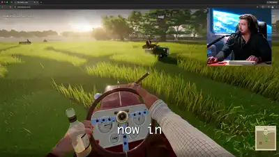</a><br>**The Duke's Lawn** by [@_MaxBlade](https://x.com/_MaxBlade)<br><sub>Multiplayer simulator · Browser, built in CNVS · One-shot</sub><br>A multiplayer lawn-mowing simulator with beers and cigars that the creator's stream chat joined live.<br><sub>🎮 Desktop only</sub><br>[**▶ Play**](https://cnvs.dev/opusmo/) · [Post · 3.9k ♥](https://x.com/_MaxBlade/status/2102513817855094922)

</td>
<td width="50%" valign="top">

<a href="https://bridge-mind.github.io/turbo-kart-rally/">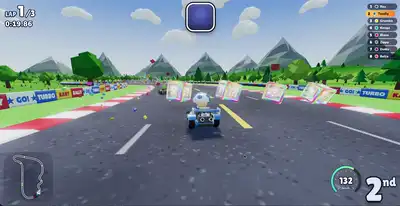</a><br>**Turbo Kart Rally** by [@bridgemindai](https://x.com/bridgemindai)<br><sub>Kart racer · Three.js · One prompt, five parallel sub-agents</sub><br>Race seven AI drivers around Palm Cove Circuit, drift for mini-turbos and throw shells and bananas, every model and sound made in code.<br><sub>🎮 WASD or arrows to steer, hold drift and release for a mini-turbo, gamepad works</sub><br>[**▶ Play**](https://bridge-mind.github.io/turbo-kart-rally/) · [Source](https://github.com/bridge-mind/turbo-kart-rally) · [Post · 3.5k ♥](https://x.com/bridgemindai/status/2102451997395866021)

</td>
</tr>
<tr>
<td width="50%" valign="top">

<a href="https://somethingbig.ai/world/">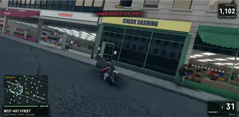</a><br>**Open World NYC** by [@mattshumer_](https://x.com/mattshumer_)<br><sub>Open world · Browser 3D · Autonomous loop running for almost a day</sub><br>A multiplayer open-world New York City you can drop into from the browser.<br>[**▶ Play**](https://somethingbig.ai/world/) · [Post · 707 ♥](https://x.com/mattshumer_/status/2102874271316078841)

</td>
<td width="50%" valign="top">

<a href="https://arkenfall.site">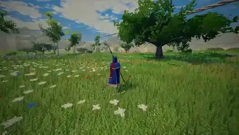</a><br>**Arkenfall** by [@LexnLin](https://x.com/LexnLin)<br><sub>Open-world action · Browser, zero assets · Opus also cut the trailer and wrote the soundtrack</sub><br>An open-world fantasy action game with creatures, a map, a story intro and a boss fight, all generated in code.<br>[**▶ Play**](https://arkenfall.site) · [Post · 447 ♥](https://x.com/LexnLin/status/2102834362530079093)

</td>
</tr>
<tr>
<td width="50%" valign="top">

<a href="https://spawn.co/@j/portal-heist/play">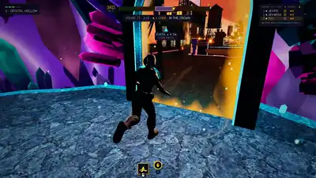</a><br>**Portal Heist** by [@jsnnsa](https://x.com/jsnnsa)<br><sub>Multiplayer heist · Spawn · 26 parallel agents overnight</sub><br>A multiplayer heist through five nested worlds, with go-karts on a giant's kitchen table, bots hunting you and friends stealing your loot.<br><sub>🎮 Phone or computer, no account</sub><br>[**▶ Play**](https://spawn.co/@j/portal-heist/play) · [Post · 347 ♥](https://x.com/jsnnsa/status/2102862008467194151)

</td>
<td width="50%" valign="top">

<a href="https://bubucn.com/en/ai-model-evals/voxel-musou">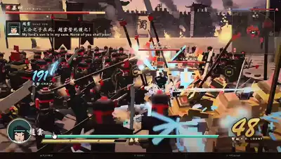</a><br>**Voxel Musou** by [@BubuStd](https://x.com/BubuStd)<br><sub>Hack and slash · Browser 3D, voxel · Opus 5.5 ultracode</sub><br>Zhao Yun takes on 300 voxel soldiers with combos, dodges and Musou attacks in a Dynasty Warriors homage.<br>[**▶ Play**](https://bubucn.com/en/ai-model-evals/voxel-musou) · [Source](https://github.com/mike007jd/voxel-musou) · [Post · 255 ♥](https://x.com/BubuStd/status/2102991290568954264)

</td>
</tr>
<tr>
<td width="50%" valign="top">

<a href="https://lagoon-tree-village.netlify.app/">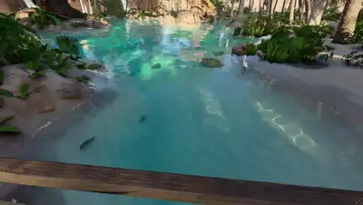</a><br>**Lagoon Tree Village** by [@cryptomanavan](https://x.com/cryptomanavan)<br><sub>Explorable world · Three.js on WebGL2, procedural · Seven-hour-plus agent session from concept art</sub><br>A huge explorable desert oasis village built into giant trees around a turquoise lagoon.<br>[**▶ Play**](https://lagoon-tree-village.netlify.app/) · [Post · 235 ♥](https://x.com/cryptomanavan/status/2102772685541347618)

</td>
<td width="50%" valign="top">

<a href="https://seiryu.miraicode.one/">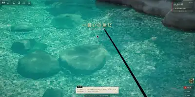</a><br>**Seiryu Fishing** by [@hayashimon1](https://x.com/hayashimon1)<br><sub>Fishing · Three.js · Under one day</sub><br>Spot fish in a crystal-clear mountain stream and cast for them in a calm fishing game.<br>[**▶ Play**](https://seiryu.miraicode.one/) · [Post · 232 ♥](https://x.com/hayashimon1/status/2102737051057832358)

</td>
</tr>
<tr>
<td width="50%" valign="top">

<a href="https://www.spawn.co/@izkimar/dalaran/play">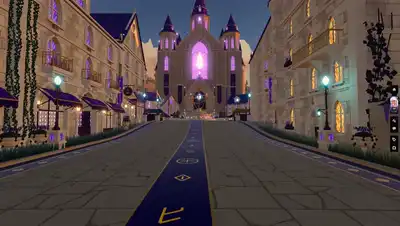</a><br>**Dalaran Reimagined** by [@Izkimar](https://x.com/Izkimar)<br><sub>Explorable world · Spawn · Prompted to go wild</sub><br>A walkable reimagining of World of Warcraft's floating mage city Dalaran, with sound.<br>[**▶ Play**](https://www.spawn.co/@izkimar/dalaran/play) · [Post · 46 ♥](https://x.com/Izkimar/status/2102965638293827698)

</td>
<td width="50%" valign="top">

<a href="https://play-de-claude.vercel.app/">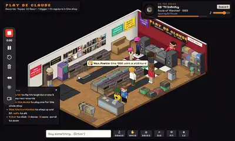</a><br>**Play De Claude** by [@illscience](https://x.com/illscience)<br><sub>Isometric exploration · Browser, Blender-made assets · One-shot</sub><br>Wander a Habbo-style isometric replica of a 1990s record store, dig through crates and preview real songs.<br><sub>🎮 Desktop</sub><br>[**▶ Play**](https://play-de-claude.vercel.app/) · [Post · 41 ♥](https://x.com/illscience/status/2102913284190220421)

</td>
</tr>
<tr>
<td width="50%" valign="top">

<a href="https://gordensun.github.io/last-firewall/">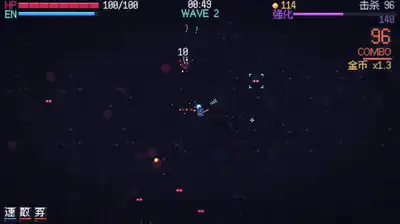</a><br>**Last Firewall** by [@Gorden_Sun](https://x.com/Gorden_Sun)<br><sub>Bullet-hell survival · Browser · One-shot</sub><br>A bullet-hell survival game where you defend the last firewall against waves of attackers.<br>[**▶ Play**](https://gordensun.github.io/last-firewall/) · [Post · 9 ♥](https://x.com/Gorden_Sun/status/2102941966556434610)

</td>
<td width="50%" valign="top">

<a href="https://sael.net/final-boss">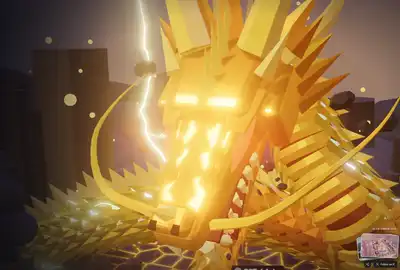</a><br>**The Final Boss** by [@RyanSael](https://x.com/RyanSael)<br><sub>Boss fight · Browser · Prompted build</sub><br>A boss fight parody of the Gemini rumor mill.<br>[**▶ Play**](https://sael.net/final-boss) · [Post · 7 ♥](https://x.com/RyanSael/status/2102970980398489940)

</td>
</tr>
<tr>
<td width="50%" valign="top">

<a href="https://alesha-pro.github.io/bench-portal/games/overrun-claude-opus-5.5/index.html">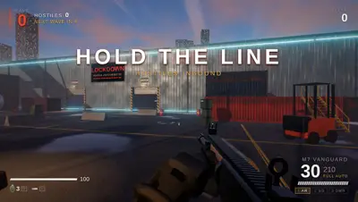</a><br>**OVERRUN: Dockyard Nine** by bench-portal<br><sub>Horde FPS · Three.js · One-shot in Claude Code</sub><br>Hold a dockyard against waves of combat synthetics with a rifle, shotgun, marksman rifle, grenades and explosive barrels.<br><sub>🎮 WASD move, mouse aim and fire</sub><br>[**▶ Play**](https://alesha-pro.github.io/bench-portal/games/overrun-claude-opus-5.5/index.html) · [Source](https://github.com/alesha-pro/bench-portal)

</td>
<td width="50%" valign="top">

<a href="https://noita.myai1010.top/opus55/">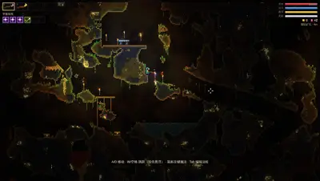</a><br>**EMBERDEEP** by Noita AI Arena<br><sub>Falling-sand roguelike · Canvas 2D · Long agentic session</sub><br>A Noita-style descent where every pixel is simulated, materials react alchemically and wand spells chain together.<br>[**▶ Play**](https://noita.myai1010.top/opus55/) · [Source](https://github.com/JerryLiu369/noita-benchmark)

</td>
</tr>
<tr>
<td width="50%" valign="top">

<a href="https://claude-opus-5-5.riba2534.cn/"></a><br>**Pelican Bike Ride** by riba2534<br><sub>Coastal cycling · Three.js, single HTML file · One sentence prompt, zero human edits</sub><br>Pedal a helmeted pelican along a coastal road through a full day and night cycle, catching fish, jumping and pulling wheelies.<br><sub>🎮 W and S speed, A and D change lane, Space jump, T wheelie</sub><br>[**▶ Play**](https://claude-opus-5-5.riba2534.cn/) · [Source](https://github.com/riba2534/claude-opus-5-5-demo)

</td>
<td width="50%" valign="top">

<a href="https://claude-opus-5-5-cf-transport-ship.pages.dev">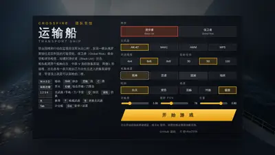</a><br>**CrossFire: Transport Ship** by riba2534<br><sub>Team FPS · Three.js, single HTML file · One sentence prompt, zero human edits</sub><br>A fan remake of the classic CrossFire Transport Ship map with recoil, bot teams and procedural gunfire audio.<br><sub>🎮 WASD move, mouse aim and fire</sub><br>[**▶ Play**](https://claude-opus-5-5-cf-transport-ship.pages.dev) · [Source](https://github.com/riba2534/claude-opus-5-5-demo)

</td>
</tr>
<tr>
<td width="50%" valign="top">

<a href="https://claude-opus-5-5-qqfeiche3d.pages.dev/">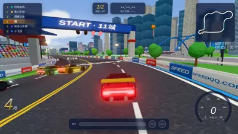</a><br>**QQ Speed Drift** by riba2534<br><sub>Drift racer · Three.js, single HTML file · One sentence prompt, zero human edits</sub><br>Drift through four tracks, from a night city circuit to a pyramid ramp finale, chaining boosts and nitro.<br><sub>🎮 Arrows steer, Shift drift, Ctrl nitro</sub><br>[**▶ Play**](https://claude-opus-5-5-qqfeiche3d.pages.dev/) · [Source](https://github.com/riba2534/claude-opus-5-5-demo)

</td>
<td width="50%" valign="top">

<a href="https://dgreenheck.github.io/tidewater/">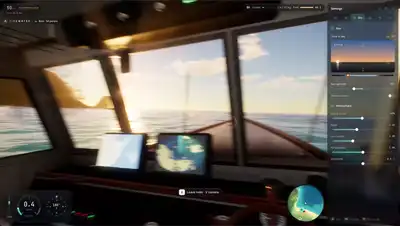</a><br>**Tidewater** by dgreenheck<br><sub>Island fishing · WebGPU / WGSL, custom renderer · Claude Code session, every commit co-authored by Opus 5.5</sub><br>Cast from the pier, beach or your own boat, fight 18 fish species on a line-tension meter, sell the catch and upgrade your gear on a tropical island.<br><sub>🎮 WASD walk and swim, mouse to cast and reel, E to board the boat</sub><br>[**▶ Play**](https://dgreenheck.github.io/tidewater/) · [Source](https://github.com/dgreenheck/tidewater)

</td>
</tr>
<tr>
<td width="50%" valign="top">

<a href="https://tanuu5.github.io/nova-lancer/">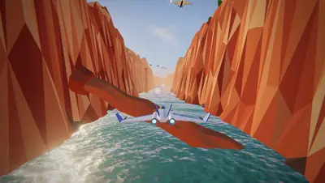</a><br>**Nova Lancer** by tanuu5<br><sub>Rail shooter · Three.js · One request, about 1 hour 40 minutes at max effort, two sub-agents for audio and portraits</sub><br>A Star Fox style rail shooter over a sunset sea, a red canyon and a neon fortress city, ending in a fight with a mechanical sea dragon.<br><sub>🎮 WASD move, J or Space shoot (hold to lock on), K bomb, L boost, gamepad and touch work</sub><br>[**▶ Play**](https://tanuu5.github.io/nova-lancer/) · [Source](https://github.com/tanuu5/nova-lancer)

</td>
<td width="50%" valign="top">

<a href="https://juliusbrussee.github.io/jazz-jackrabbit-remastered/">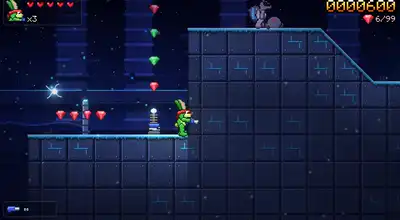</a><br>**Jazz Jackrabbit Opus Edition** by JuliusBrussee<br><sub>Platformer · Canvas 2D, single 180 KB HTML file · Launch-day Claude Code session</sub><br>A modern fan remake of the 1994 run-and-gun platformer with five worlds, two bosses and procedural art and music in one file.<br><sub>🎮 Keyboard or gamepad</sub><br>[**▶ Play**](https://juliusbrussee.github.io/jazz-jackrabbit-remastered/) · [Source](https://github.com/JuliusBrussee/jazz-jackrabbit-remastered)

</td>
</tr>
<tr>
<td width="50%" valign="top">

<a href="https://nipale-ai.github.io/opus-5-5-overnight-builds/fall-line/">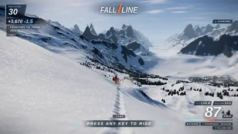</a><br>**Fall Line** by Nipale-ai<br><sub>Freeride snowboarding · Three.js · One brief, 339 minutes alone overnight in headless Claude Code at xhigh, 111 commits</sub><br>Drop into a mountain on a snowboard or skis, chain tricks and ride events across an open freeride map.<br>[**▶ Play**](https://nipale-ai.github.io/opus-5-5-overnight-builds/fall-line/) · [Source](https://github.com/Nipale-ai/opus-5-5-overnight-builds)

</td>
<td width="50%" valign="top">

<a href="https://haruka-apps-games.itch.io/lastfall-3d-battle-royale-zombie-survival">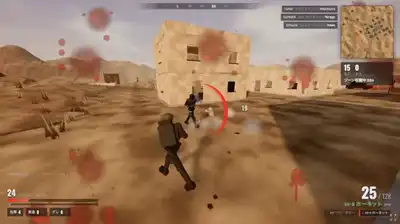</a><br>**LASTFALL** by [@haruka_apps](https://x.com/haruka_apps)<br><sub>Battle royale and zombie survival · Three.js / WebGL</sub><br>Parachute onto an island against 23 AI bots in a shrinking zone, or hold out through ten zombie waves under a blood moon.<br><sub>🎮 WASD, mouse aim and fire, V toggles first and third person</sub><br>[**▶ Play**](https://haruka-apps-games.itch.io/lastfall-3d-battle-royale-zombie-survival)

</td>
</tr>
<tr>
<td width="50%" valign="top">

<a href="https://haruka-apps-games.itch.io/neon-arcade-pinball-game-center-nova">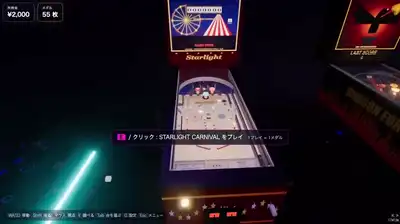</a><br>**Game Center NOVA** by [@haruka_apps](https://x.com/haruka_apps)<br><sub>First-person pinball arcade · Three.js / WebGL</sub><br>Walk a neon late-night arcade in first person, change yen for tokens and play pinball tables from 1978, 1998 and 2099.<br><sub>🎮 PC only, WASD walk, flipper keys at each table</sub><br>[**▶ Play**](https://haruka-apps-games.itch.io/neon-arcade-pinball-game-center-nova) · [Post](https://x.com/haruka_apps/status/2102703140080673090)

</td>
<td width="50%" valign="top">

<a href="https://aibengineering.github.io/sprout-quest/">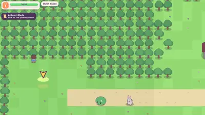</a><br>**Sprout Quest** by aibengineering<br><sub>Mobile action RPG · Canvas, Blender-rendered sprites, Bun · 11 plain-language prompts, about 4 hours 25 minutes</sub><br>Leave Sprout Village for real-time arena battles, level up, craft gear at the forge and push east to the dragon of Ember Peak.<br><sub>🎮 Touch, best on a phone in portrait</sub><br>[**▶ Play**](https://aibengineering.github.io/sprout-quest/) · [Source](https://github.com/aibengineering/sprout-quest)

</td>
</tr>
<tr>
<td width="50%" valign="top">

<a href="https://vasu-devs.github.io/FishSlop_Opus5.5/">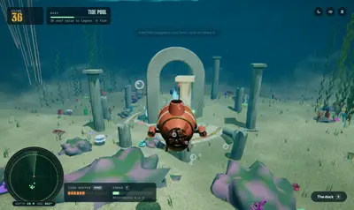</a><br>**FishSlop Opus 5.5** by vasu-devs<br><sub>Submarine aquarium sim · Three.js, TypeScript · Claude Code session</sub><br>Pilot a small sub around a 3D reef, feed fish, ping sonar to reveal new species and buy fish and parts to grow the aquarium.<br>[**▶ Play**](https://vasu-devs.github.io/FishSlop_Opus5.5/) · [Source](https://github.com/vasu-devs/FishSlop_Opus5.5)

</td>
<td width="50%" valign="top">

<a href="https://terrabrowser.vercel.app">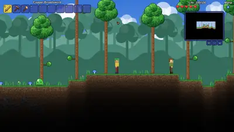</a><br>**Terrabrowser** by Wimmboo2<br><sub>Sandbox action-adventure · Canvas 2D, ES modules</sub><br>A Terraria-style dig, build and fight sandbox with ores, crafting, NPCs, bosses and a generated world.<br>[**▶ Play**](https://terrabrowser.vercel.app) · [Source](https://github.com/Wimmboo2/Terrabrowser)

</td>
</tr>
<tr>
<td width="50%" valign="top">

<a href="https://kjlkurt.github.io/waterslide-game-opus-5.5/">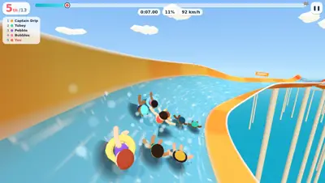</a><br>**Slide Rush** by KJLKurt<br><sub>Waterslide racer · Three.js</sub><br>Race twelve rivals down a giant 3D waterslide, hit the ramps, find the shortcut and try not to fly off the track.<br><sub>🎮 Steer and jump, mobile-first touch controls</sub><br>[**▶ Play**](https://kjlkurt.github.io/waterslide-game-opus-5.5/) · [Source](https://github.com/KJLKurt/waterslide-game-opus-5.5)

</td>
<td width="50%" valign="top">

<a href="https://brianm3050.github.io/amar.io/">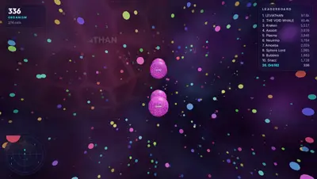</a><br>**AMAR.IO** by brianm3050<br><sub>3D multiplayer .io · Three.js, custom shaders, WebRTC</sub><br>Agar.io in full 3D, fly in any direction, split and devour other cells in instant peer-to-peer multiplayer with AI bots.<br><sub>🎮 Arrow keys steer, Space split, F eject, S brake, touch stick on phones</sub><br>[**▶ Play**](https://brianm3050.github.io/amar.io/) · [Source](https://github.com/brianm3050/amar.io)

</td>
</tr>
<tr>
<td width="50%" valign="top">

<a href="https://cahlik.net/palmera-bay/">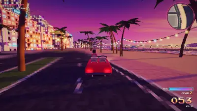</a><br>**Palmera Bay** by vcahlik<br><sub>Free-roam driving · Three.js · 30-minute auto-mode first pass, then a few prompts, medium effort</sub><br>Cruise a convertible around a sunny coastal city with arcade drift, nitro flames, skid marks and several camera views.<br><sub>🎮 Arrow keys or WASD drive, nitro, camera toggle</sub><br>[**▶ Play**](https://cahlik.net/palmera-bay/) · [Source](https://github.com/vcahlik/palmera-bay)

</td>
<td width="50%" valign="top">

<a href="https://promptengineer48.github.io/claude-opus-5.5-games/rooftop-sniper/offline/index.html">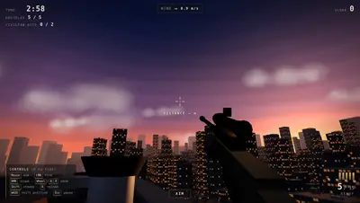</a><br>**Rooftop Sniper: Last Light** by PromptEngineer48<br><sub>First-person sniper · Three.js</sub><br>Hold a rooftop at dusk and pick off targets across a city with a scoped rifle.<br><sub>🎮 Mouse aim, right click scope, left click fire</sub><br>[**▶ Play**](https://promptengineer48.github.io/claude-opus-5.5-games/rooftop-sniper/offline/index.html) · [Source](https://github.com/PromptEngineer48/claude-opus-5.5-games)

</td>
</tr>
<tr>
<td width="50%" valign="top">

<a href="https://promptengineer48.github.io/claude-opus-5.5-games/neon-siege/">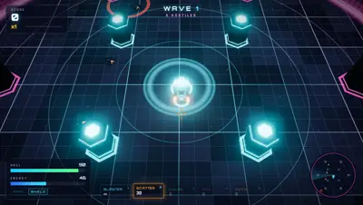</a><br>**Neon Siege** by PromptEngineer48<br><sub>Arena shooter · Three.js</sub><br>Fight waves of robots in a neon arena, dash through bots, reflect their bolts with a shield and face an Overseer boss every fifth wave.<br><sub>🎮 WASD move, mouse aim, hold left click fire</sub><br>[**▶ Play**](https://promptengineer48.github.io/claude-opus-5.5-games/neon-siege/) · [Source](https://github.com/PromptEngineer48/claude-opus-5.5-games)

</td>
<td width="50%" valign="top">

<a href="https://tanuu5.github.io/clawd-7-8/">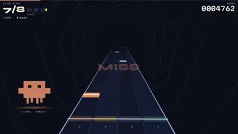</a><br>**Clawd 7/8** by tanuu5<br><sub>Rhythm game · Three.js, Web Audio</sub><br>Hit notes on a four-lane highway to a song in 7/8 time while Clawd dances beside the track.<br><sub>🎮 D F J K or arrow keys, multi-touch on phones</sub><br>[**▶ Play**](https://tanuu5.github.io/clawd-7-8/) · [Source](https://github.com/tanuu5/clawd-7-8)

</td>
</tr>
<tr>
<td width="50%" valign="top">

<a href="https://tanuu5.github.io/ink-arcade/">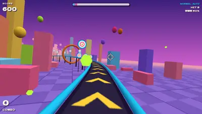</a><br>**Ink Arcade** by tanuu5<br><sub>Rail shooting gallery · Three.js</sub><br>Two ink-splat shooting games, including a 3D rail shooter whose shots fire on the soundtrack's sixteenth notes and ends with a giant target boss.<br><sub>🎮 Mouse or touch to aim</sub><br>[**▶ Play**](https://tanuu5.github.io/ink-arcade/) · [Source](https://github.com/tanuu5/ink-arcade)

</td>
<td width="50%" valign="top">

<a href="https://siwo55.github.io/dragon-sail-opus/">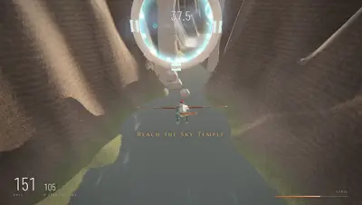</a><br>**Dragon Sail** by siwo55<br><sub>Dragon flight racer · Three.js, single HTML file</sub><br>Ride a dragon through mountain canyons and eleven gates before a storm catches you, boosting on near misses.<br><sub>🎮 W and S pitch, A and D roll, Space boost, gamepad and touch work</sub><br>[**▶ Play**](https://siwo55.github.io/dragon-sail-opus/) · [Source](https://github.com/siwo55/dragon-sail-opus)

</td>
</tr>
<tr>
<td width="50%" valign="top">

<a href="https://senko.net/vibecode-bench/2026/rts-opus-5.5.html">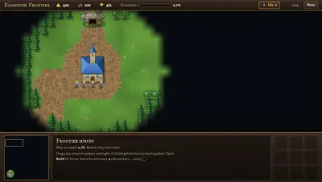</a><br>**Fogbound Frontier** by senko<br><sub>Real-time strategy · Canvas, single HTML file · One-shot benchmark prompt at xhigh, about 47 minutes</sub><br>A WarCraft-style RTS with resource gathering, unit production and fog-of-war exploration against an AI.<br>[**▶ Play**](https://senko.net/vibecode-bench/2026/rts-opus-5.5.html) · [Source](https://gist.github.com/senko/0431525092b5af63618ab05666305e08) · [Post](https://senko.net/vibecode-bench/)

</td>
<td width="50%" valign="top">

<a href="https://senko.net/vibecode-bench/2026/flysim-opus-5.5.html">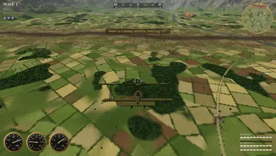</a><br>**Over the Lines** by senko<br><sub>WW1 dogfight · Three.js, single HTML file · One-shot benchmark prompt at xhigh</sub><br>Fly a WW1 biplane over generated terrain and dogfight enemy planes.<br>[**▶ Play**](https://senko.net/vibecode-bench/2026/flysim-opus-5.5.html) · [Source](https://gist.github.com/senko/1dea1e984fdff2d3091dc9ff3a528a04) · [Post](https://senko.net/vibecode-bench/)

</td>
</tr>
<tr>
<td width="50%" valign="top">

<a href="https://openvglab.github.io/awesome-opus5.5-frontend-showcases/svg/kitchen-rush.svg">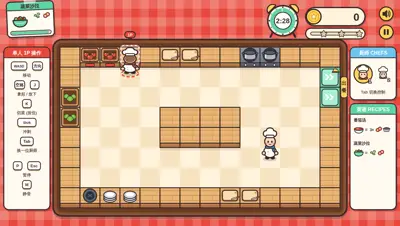</a><br>**Kitchen Rush** by OpenVGLab<br><sub>Co-op cooking · Single self-contained SVG · Agentic generation from a published prompt</sub><br>An Overcooked-style top-down kitchen where one or two players on one keyboard chop, cook and plate orders before they time out.<br><sub>🎮 Two players share the keyboard</sub><br>[**▶ Play**](https://openvglab.github.io/awesome-opus5.5-frontend-showcases/svg/kitchen-rush.svg) · [Source](https://github.com/OpenVGLab/awesome-opus5.5-frontend-showcases)

</td>
<td width="50%" valign="top">


</td>
</tr>
</table>

### GPT-6 Astra (47)

<table>
<tr>
<td width="50%" valign="top">

<a href="https://www.paperroute.lol/">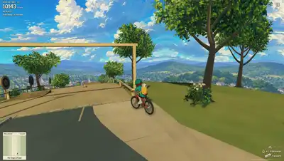</a><br>**Paperboy Browser Remake (Paper Route)** by [@builtbysketch](https://x.com/builtbysketch)<br><sub>Delivery/driving · Blender/WebGL · multi-prompt</sub><br>Deliver papers by bike/vehicle through a modeled neighborhood in an unofficial Paperboy fan remake.<br>[**▶ Play**](https://www.paperroute.lol/) · [Post · 6.8k ♥](https://x.com/builtbysketch/status/2098777028078211283)

</td>
<td width="50%" valign="top">

<a href="https://storm-race.vercel.app/">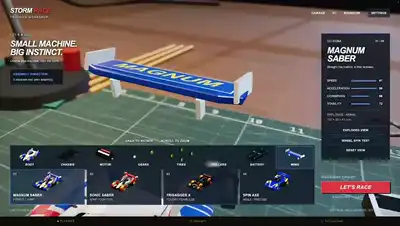</a><br>**STORM RACE** by [@BubuStd](https://x.com/BubuStd)<br><sub>Mini 4wd racing</sub><br>Mini 4WD racing with an exploded-parts garage, boost and changing dry, rainy and stormy track conditions.<br>[**▶ Play**](https://storm-race.vercel.app/) · [Post · 4.4k ♥](https://x.com/BubuStd/status/2096587056755638553)

</td>
</tr>
<tr>
<td width="50%" valign="top">

<a href="https://vheissu.github.io/hit-and-run-web/">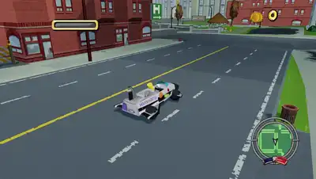</a><br>**The Simpsons: Hit & Run — Browser Recreation** by [@CtrlAltDwayne](https://x.com/CtrlAltDwayne)<br><sub>Open-world driving/mission · Three.js · long agentic session</sub><br>Drive around Springfield picking up the first Simpsons Hit & Run mission, reverse-engineered from the PS2 original.<br>[**▶ Play**](https://vheissu.github.io/hit-and-run-web/) · [Post · 2.8k ♥](https://x.com/CtrlAltDwayne/status/2096872309936287887)

</td>
<td width="50%" valign="top">

<a href="https://universe-duel.vercel.app">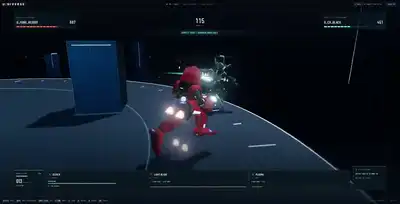</a><br>**Universe Duel** by [@hayashimon1](https://x.com/hayashimon1)<br><sub>Robot combat · browser/WebGL · multi-prompt</sub><br>Fight another robot with dashes, homing attacks and laser-blade combat.<br>[**▶ Play**](https://universe-duel.vercel.app) · [Post · 1.9k ♥](https://x.com/hayashimon1/status/2096255665778069957)

</td>
</tr>
<tr>
<td width="50%" valign="top">

<a href="https://zork-underground-empire.netlify.app/">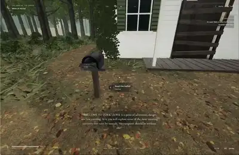</a><br>**Zork in 3D (Underground Empire)** by [@emollick](https://x.com/emollick)<br><sub>3d action-adventure · Three.js · multi-prompt</sub><br>Explore a 3D adaptation of the classic Zork text adventure with puzzles and combat.<br>[**▶ Play**](https://zork-underground-empire.netlify.app/) · [Post · 1.8k ♥](https://x.com/emollick/status/2096047660662722620)

</td>
<td width="50%" valign="top">

<a href="https://satriodewantono.com/breakdance/">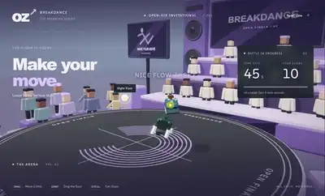</a><br>**Oz Breakdance** by [@satrio_d](https://x.com/satrio_d)<br><sub>Timed dance/arcade · browser/ragdoll physics · multi-prompt</sub><br>Land ragdoll breakdance moves and hit foot targets in a timed scoring arena.<br>[**▶ Play**](https://satriodewantono.com/breakdance/) · [Post · 609 ♥](https://x.com/satrio_d/status/2096022866097758500)

</td>
</tr>
<tr>
<td width="50%" valign="top">

<a href="https://blackwater-roan.vercel.app/">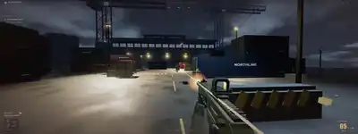</a><br>**BLACKWATER · Silent Harbor** by [@WoahWurdz](https://x.com/WoahWurdz)<br><sub>Tactical fps</sub><br>Infiltrate a rain-soaked freight terminal in a tactical FPS with a detailed carbine, combat HUD and nine hostiles.<br>[**▶ Play**](https://blackwater-roan.vercel.app/) · [Source](https://github.com/Hiraeth010/blackwater) · [Post · 342 ♥](https://x.com/WoahWurdz/status/2095958882732355908)

</td>
<td width="50%" valign="top">

<a href="https://gogh-strike.surge.sh/">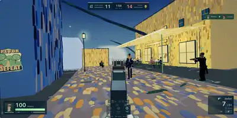</a><br>**Gogh Strike** by [@petergostev](https://x.com/petergostev)<br><sub>5v5 fps · Three.js/Blender · long agentic session (6h)</sub><br>Play a painter-themed 5v5 first-person shooter set in Van Gogh's town, with bot teammates and rivals.<br>[**▶ Play**](https://gogh-strike.surge.sh/) · [Source](https://github.com/petergpt/gogh-strike) · [Post · 166 ♥](https://x.com/petergostev/status/2096013280519016608)

</td>
</tr>
<tr>
<td width="50%" valign="top">

<a href="https://vale-dos-vinhedos.lucas579686.chatgpt.site/">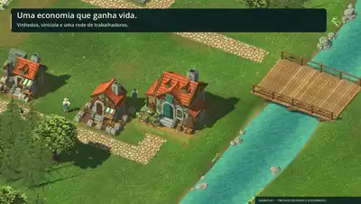</a><br>**The Free Game** by [@LucasMarquesSv](https://x.com/LucasMarquesSv)<br><sub>Medieval village builder</sub><br>Build a medieval village with roads, workers and production chains, presented as a detailed 3D tabletop settlement.<br>[**▶ Play**](https://vale-dos-vinhedos.lucas579686.chatgpt.site/) · [Source](https://github.com/LucasMarquesShiva/the-free-game) · [Post · 144 ♥](https://x.com/LucasMarquesSv/status/2096772160404504583)

</td>
<td width="50%" valign="top">

<a href="https://no-moat.petergyang.chatgpt.site/">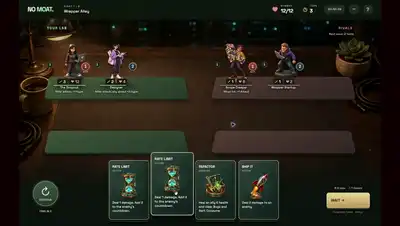</a><br>**No Moat** by [@petergyang](https://x.com/petergyang)<br><sub>Roguelike deckbuilder</sub><br>A startup-themed roguelike deckbuilder: recruit a team and play cards against copycats, bugs and cloud bills.<br>[**▶ Play**](https://no-moat.petergyang.chatgpt.site/) · [Post · 132 ♥](https://x.com/petergyang/status/2096297378584375672)

</td>
</tr>
<tr>
<td width="50%" valign="top">

<a href="https://agiofempires.com/">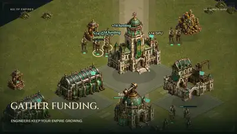</a><br>**AGI of Empires — The Compute Wars** by [@timourxyz](https://x.com/timourxyz)<br><sub>Real-time strategy · browser 2D · multi-prompt</sub><br>Command an AI lab racing rivals to superintelligence in an Age-of-Empires-inspired RTS satire.<br>[**▶ Play**](https://agiofempires.com/) · [Post · 82 ♥](https://x.com/timourxyz/status/2096662786692776293)

</td>
<td width="50%" valign="top">

<a href="https://alesha-pro.github.io/bench-portal/games/voidbound-choir-of-ash/">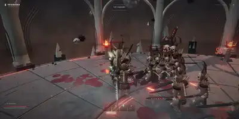</a><br>**Voidbound: The Choir of Ash** by [@superalesha](https://x.com/superalesha)<br><sub>Third-person hack-and-slash · Three.js/WebGL · multi-prompt</sub><br>Fight demons with sword combat, dodging and area magic in a cathedral arena above a dead star.<br>[**▶ Play**](https://alesha-pro.github.io/bench-portal/games/voidbound-choir-of-ash/) · [Source](https://github.com/alesha-pro/bench-portal) · [Post · 71 ♥](https://x.com/superalesha/status/2095988972879335792)

</td>
</tr>
<tr>
<td width="50%" valign="top">

<a href="https://wesche.com/lab/astra/boat-explorer/">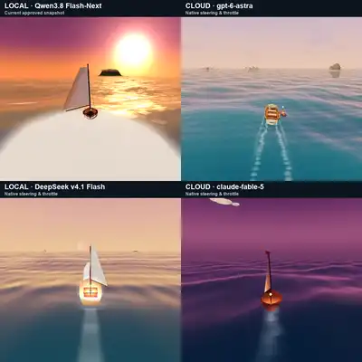</a><br>**Sundrift — Take the Slow Way Home** by [@WescheNex1q](https://x.com/WescheNex1q)<br><sub>Sailing exploration · Three.js</sub><br>Slow-paced sailing exploration game tracking nautical-mile distance and nearest-shore proximity.<br>[**▶ Play**](https://wesche.com/lab/astra/boat-explorer/) · [Post · 68 ♥](https://x.com/WescheNex1q/status/2100043868565561533)

</td>
<td width="50%" valign="top">

<a href="https://www.spawn.co/@izkimar/the-crownless/play">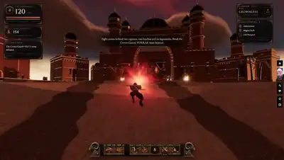</a><br>**The Crownless** by [@Izkimar](https://x.com/Izkimar)<br><sub>Action roguelike · Spawn platform</sub><br>Roguelike action game on the Spawn platform: melee/jump combat through camps with leveling and soul upgrades.<br>[**▶ Play**](https://www.spawn.co/@izkimar/the-crownless/play) · [Post · 59 ♥](https://x.com/Izkimar/status/2100753871903855095)

</td>
</tr>
<tr>
<td width="50%" valign="top">

<a href="https://onemorevine.bennash.dev/"></a><br>**One More Vine — Into the Wild** by [@bennash](https://x.com/bennash)<br><sub>Jungle platformer · browser 2D · multi-prompt</sub><br>Swing on vines across four jungle platforming levels, dodging pits and crocodiles, Pitfall-style.<br>[**▶ Play**](https://onemorevine.bennash.dev/) · [Post · 54 ♥](https://x.com/bennash/status/2096282758930645170)

</td>
<td width="50%" valign="top">

<a href="https://gpt6astra-game.vercel.app/"></a><br>**Harbor Skirmish** by [@OpenDesignHQ](https://x.com/OpenDesignHQ)<br><sub>Harbor combat/arcade · Three.js</sub><br>Fight through a coastal town skirmish, part of a head-to-head model comparison build.<br>[**▶ Play**](https://gpt6astra-game.vercel.app/) · [Post · 52 ♥](https://x.com/OpenDesignHQ/status/2097635757917983223)

</td>
</tr>
<tr>
<td width="50%" valign="top">

<a href="https://fluffy-biscotti-dad318.netlify.app/"></a><br>**前线指令 / Frontline Command** by [@HDLhN783wtLkpPR](https://x.com/HDLhN783wtLkpPR)<br><sub>Modern-war rts</sub><br>Build a base, contest resource zones and command tanks, infantry, aircraft and drones against AI armies in a modern-war RTS, using spies and intelligence to gain an advantage.<br>[**▶ Play**](https://fluffy-biscotti-dad318.netlify.app/) · [Post · 30 ♥](https://x.com/HDLhN783wtLkpPR/status/2097321360641122393)

</td>
<td width="50%" valign="top">

<a href="https://bubucn.com/ai-model-evals/flop-club/game/index.html"></a><br>**FLOP CLUB** by [@BubuStd](https://x.com/BubuStd)<br><sub>Diving/trick sports · browser 3D · one-shot</sub><br>Dive off a high platform, pull flips, and try to land in the target ring.<br>[**▶ Play**](https://bubucn.com/ai-model-evals/flop-club/game/index.html) · [Post · 26 ♥](https://x.com/BubuStd/status/2096402783805354091)

</td>
</tr>
<tr>
<td width="50%" valign="top">

<a href="https://tidal-rush-paradise-gp.skirano.chatgpt.site/"></a><br>**TIDAL RUSH — Paradise GP** by [@alexgetmancom](https://x.com/alexgetmancom)<br><sub>Kart racer · browser 3D</sub><br>Race a kart through a tropical circuit with drifting.<br>[**▶ Play**](https://tidal-rush-paradise-gp.skirano.chatgpt.site/) · [Post · 25 ♥](https://x.com/alexgetmancom/status/2095598460921614825)

</td>
<td width="50%" valign="top">

<a href="https://luna-crimson-requiem.ponsuke.chatgpt.site/"></a><br>**LUNA — Crimson Requiem** by [@ponsuke_otowa](https://x.com/ponsuke_otowa)<br><sub>Side-scrolling action · browser 2D · one-shot</sub><br>Fight through a gothic red-moon street as LUNA in a SNES-style side-scrolling action game.<br>[**▶ Play**](https://luna-crimson-requiem.ponsuke.chatgpt.site/) · [Post · 25 ♥](https://x.com/ponsuke_otowa/status/2096531744933425299)

</td>
</tr>
<tr>
<td width="50%" valign="top">

<a href="https://orr-rush-bengaluru.ravitheja.chatgpt.site/"></a><br>**Bengaluru ORR Rush** by [@ravithejads](https://x.com/ravithejads)<br><sub>Street racing · browser</sub><br>Race through Bengaluru's Outer Ring Road from Bellandur to Marathahalli, dodging traffic and potholes.<br>[**▶ Play**](https://orr-rush-bengaluru.ravitheja.chatgpt.site/) · [Post · 23 ♥](https://x.com/ravithejads/status/2097181044625887392)

</td>
<td width="50%" valign="top">

<a href="https://mir176-dragon-warrior.geekcatxx.chatgpt.site/"></a><br>**热血归来 · 八荒幻世 / Mir176 Dragon Warrior** by [@GeekCatX](https://x.com/GeekCatX)<br><sub>Action rpg (legend of mir-inspired)</sub><br>A Legend-inspired action RPG with warrior, mage and taoist classes, equipment, dungeon combat and auto-battle.<br>[**▶ Play**](https://mir176-dragon-warrior.geekcatxx.chatgpt.site/) · [Post · 15 ♥](https://x.com/GeekCatX/status/2097530887558865115)

</td>
</tr>
<tr>
<td width="50%" valign="top">

<a href="https://neonwake.ethraship.com/"></a><br>**Neon Wake — Dubai Coast** by [@captain_m1k](https://x.com/captain_m1k)<br><sub>Boat racing · browser 3D · multi-prompt</sub><br>Race a boat along a neon-lit Dubai coastline circuit, four boats over three laps.<br>[**▶ Play**](https://neonwake.ethraship.com/) · [Post · 13 ♥](https://x.com/captain_m1k/status/2098310479714369926)

</td>
<td width="50%" valign="top">

<a href="https://asteroids-deepfield-cockpit.dan200200.chatgpt.site/"></a><br>**ASTEROIDS · Deepfield** by [@DantesClown](https://x.com/DantesClown)<br><sub>Space shooter cockpit sim</sub><br>Pilot an Asteroids-style cockpit with four camera views, radar, twin cannons and inertial flight.<br>[**▶ Play**](https://asteroids-deepfield-cockpit.dan200200.chatgpt.site/) · [Post · 4 ♥](https://x.com/DantesClown/status/2096085439052452064)

</td>
</tr>
<tr>
<td width="50%" valign="top">

<a href="https://threapchills.github.io/MagicCarpetWizard/"></a><br>**Magic Carpet Wizard** by [@threapchills](https://x.com/threapchills)<br><sub>3d arcade flying/combat · WebGL2</sub><br>Fly a magic carpet and cast spells in a 3D browser arcade game.<br>[**▶ Play**](https://threapchills.github.io/MagicCarpetWizard/) · [Source](https://github.com/threapchills/MagicCarpetWizard)

</td>
<td width="50%" valign="top">

<a href="https://bonkshot.com/"></a><br>**Bonkshot** by [@edmund5](https://x.com/edmund5)<br><sub>Physics destruction/puzzle · browser physics</sub><br>Aim, drag and launch characters to smash enemy structures and trigger chain-reaction explosions.<br><sub>🎮 drag to aim and release to launch</sub><br>[**▶ Play**](https://bonkshot.com/) · [Post](https://x.com/edmund5/status/2097603093819261002)

</td>
</tr>
<tr>
<td width="50%" valign="top">

<a href="https://bench-portal.pages.dev/games/boat-astra-deepseek/"></a><br>**Tidebreak: Corsair Run** by alesha-pro<br><sub>Boat combat racer · Three.js · multi-prompt</sub><br>Follow checkpoint gates through palm islands and a sea cave, collect weapon upgrades and fight enemy boats after a waterfall jump.<br>[**▶ Play**](https://bench-portal.pages.dev/games/boat-astra-deepseek/) · [Source](https://github.com/alesha-pro/bench-portal/tree/main/games/boat-astra-deepseek)

</td>
<td width="50%" valign="top">

<a href="https://bench-portal.pages.dev/games/breach-blacksite-astra/"></a><br>**BREACH — Blacksite** by alesha-pro<br><sub>Horde-survival fps · Three.js</sub><br>Fight escalating waves of enemies with three detailed weapons, recoil-and-inertia gunplay, sprint/slide/reload animations and procedural audio.<br><sub>🎮 WASD move, mouse aim/fire, likely sprint/slide/reload keys</sub><br>[**▶ Play**](https://bench-portal.pages.dev/games/breach-blacksite-astra/) · [Source](https://github.com/alesha-pro/bench-portal/tree/main/games/breach-blacksite-astra)

</td>
</tr>
<tr>
<td width="50%" valign="top">

<a href="https://bench-portal.pages.dev/games/gpt-6-astra-2026-09-11/"></a><br>**GPT-6 Astra 11.09.2026 (ZERO MERCY)** by alesha-pro<br><sub>Arena-survival fps · Three.js</sub><br>Survive escalating hordes with three weapons, red-dot/iron sights, grenades, explosive barrels and ammo drops in a shader-lit arena.<br><sub>🎮 WASD move, mouse aim/fire, sprint-slide movement</sub><br>[**▶ Play**](https://bench-portal.pages.dev/games/gpt-6-astra-2026-09-11/) · [Source](https://github.com/alesha-pro/bench-portal/tree/main/games/gpt-6-astra-2026-09-11)

</td>
<td width="50%" valign="top">

<a href="https://bench-portal.pages.dev/games/kart-astra-deepseek/"></a><br>**Lumen Rally** by alesha-pro<br><sub>Kart racer · Three.js · multi-prompt</sub><br>A browser kart racer built from a shared game brief, one of a four-way model comparison set.<br>[**▶ Play**](https://bench-portal.pages.dev/games/kart-astra-deepseek/) · [Source](https://github.com/alesha-pro/bench-portal/tree/main/games/kart-astra-deepseek)

</td>
</tr>
<tr>
<td width="50%" valign="top">

<a href="https://bench-portal.pages.dev/games/kart-astra-solo/"></a><br>**Tidebloom Rally** by alesha-pro<br><sub>Kart racer · Three.js · one-shot</sub><br>A browser kart racer built by GPT-6 Astra solo (no subagents), from the same brief as three other comparison entries.<br>[**▶ Play**](https://bench-portal.pages.dev/games/kart-astra-solo/) · [Source](https://github.com/alesha-pro/bench-portal/tree/main/games/kart-astra-solo)

</td>
<td width="50%" valign="top">

<a href="https://bench-portal.pages.dev/games/voidrunner-astra/"></a><br>**VOIDRUNNER: Orbital Combat League** by alesha-pro<br><sub>Anti-gravity combat racer · Three.js</sub><br>Race three Blender-authored hovercraft above a fractured ocean world, boosting, airbrake-drifting and fighting rivals with weapons and shields.<br>[**▶ Play**](https://bench-portal.pages.dev/games/voidrunner-astra/) · [Source](https://github.com/alesha-pro/bench-portal/tree/main/games/voidrunner-astra)

</td>
</tr>
<tr>
<td width="50%" valign="top">

<a href="https://noita.myai1010.top/astra/"></a><br>**EMBER DEEP** by JerryLiu369<br><sub>Destructible pixel-physics roguelike (noita-style) · Canvas 2D (vanilla JS) · long agentic session (24h)</sub><br>Descend through a destructible, pixel-simulated cave system mixing alchemy and falling-sand physics, casting chained wand spells while managing heat/material interactions.<br>[**▶ Play**](https://noita.myai1010.top/astra/) · [Source](https://github.com/JerryLiu369/noita-benchmark/pull/3)

</td>
<td width="50%" valign="top">

<a href="https://astrafloor.berochlu.workers.dev/"></a><br>**Astra Floor** by BEROCHLU<br><sub>Fps zombie survival</sub><br>Survive escalating zombie waves in a 3D first-person shooter with recoil control, stamina management, katana attacks and a final boss.<br>[**▶ Play**](https://astrafloor.berochlu.workers.dev/)

</td>
</tr>
<tr>
<td width="50%" valign="top">

<a href="https://stadium-elite.mindblown.ai/"></a><br>**Stadium Elite — El Clásico** by [@mind](https://x.com/mind)<br><sub>3d football/soccer</sub><br>Play an 11-a-side Barcelona–Real Madrid football match, passing, shooting and switching players in a 3D stadium.<br>[**▶ Play**](https://stadium-elite.mindblown.ai/)

</td>
<td width="50%" valign="top">

<a href="https://iron-bastion.zecoba.workers.dev/"></a><br>**IRON BASTION / 钢铁防线** by chat01.ai<br><sub>3d tower defense</sub><br>Defend a beacon against waves of enemy tanks across six sectors in a 3D battlefield with destructible brick walls, a dash and an electromagnetic pulse.<br>[**▶ Play**](https://iron-bastion.zecoba.workers.dev/)

</td>
</tr>
<tr>
<td width="50%" valign="top">

<a href="https://dust-ii-map.yelin8130.chatgpt.site/"></a><br>**DUST II · 沙漠行动 / Desert Operations** by lin_ye / lin ye<br><sub>Fps (cs-style)</sub><br>Counter-Strike Dust II-style FPS with bots, weapon switching (AK-47/USP-S) and kill tracking.<br>[**▶ Play**](https://dust-ii-map.yelin8130.chatgpt.site/)

</td>
<td width="50%" valign="top">

<a href="https://dave-2cm.pages.dev/"></a><br>**潜水员戴夫 / Dave the Diver** by dudu<br><sub>Underwater sim + restaurant management</sub><br>A browser recreation of Dave the Diver combining underwater spearfishing, sushi-restaurant management and island farming.<br>[**▶ Play**](https://dave-2cm.pages.dev/)

</td>
</tr>
<tr>
<td width="50%" valign="top">

<a href="https://dust-front.mustafaakin.dev/"></a><br>**DUST FRONT** by [@mustafaakin](https://x.com/mustafaakin)<br><sub>Single-player rts</sub><br>Command a single-player RTS army, build a base, capture sites and coordinate ground and air forces.<br>[**▶ Play**](https://dust-front.mustafaakin.dev/)

</td>
<td width="50%" valign="top">

<a href="https://landifyoucan.naylalabs.xyz/"></a><br>**Land, If You Can** by Taniai_<br><sub>Flight sim</sub><br>Cabin-fever intro then a full jet cockpit with tower comms, autopilot and manual flight controls (200 knots, 3,000 ft observed).<br><sub>🎮 E to stand, R to call tower, P to take manual control</sub><br>[**▶ Play**](https://landifyoucan.naylalabs.xyz/)

</td>
</tr>
<tr>
<td width="50%" valign="top">

<a href="https://mindblown.ai/games/the-sunshard"></a><br>**The Sunshard** by [@mindblown_ai](https://x.com/mindblown_ai)<br><sub>Voxel action rpg</sub><br>Explore a voxel-style action RPG, fight Hollowborn with Spark Bolt and Sunburst, blink away from danger and awaken the sun gate.<br>[**▶ Play**](https://mindblown.ai/games/the-sunshard)

</td>
<td width="50%" valign="top">

<a href="https://glider.game/"></a><br>**Glider — One Throw. Endless Sky.** by mrtwizzles<br><sub>Paper-airplane flight sim · long agentic session</sub><br>Endless paper-airplane flight game with free-roam exploration, distance/speed/altitude HUD; author reports a 34-hour x-high build.<br>[**▶ Play**](https://glider.game/)

</td>
</tr>
<tr>
<td width="50%" valign="top">

<a href="https://junk-run.pages.dev/"></a><br>**JUNK RUN** by [@hermesailab](https://x.com/hermesailab)<br><sub>Vehicle-building downhill racer</sub><br>Assemble a gravity-powered vehicle from scrapyard parts and send it downhill; starts in a first-person workshop.<br>[**▶ Play**](https://junk-run.pages.dev/) · [Post](https://x.com/hermesailab/status/2097508053901840850)

</td>
<td width="50%" valign="top">

<a href="https://apex-club-racing.vercel.app"></a><br>**APEX CLUB — Bay Kart Grand Prix** by Ryan<br><sub>Kart racing · Three.js</sub><br>Race three laps around Bay Circuit, choose from six karts, and charge corner-exit mini turbos to climb the solo rankings or score for a 4v4 team.<br>[**▶ Play**](https://apex-club-racing.vercel.app)

</td>
</tr>
<tr>
<td width="50%" valign="top">

<a href="https://knightmare-medusa-3d.robin-hwang.chatgpt.site/"></a><br>**Knightmare — Medusa’s Temple** by [@MinHoHwang1](https://x.com/MinHoHwang1)<br><sub>Boss-fight action</sub><br>3D boss-battle arena against Medusa with a purify special move and cooldown-based combat.<br>[**▶ Play**](https://knightmare-medusa-3d.robin-hwang.chatgpt.site/)

</td>
<td width="50%" valign="top">

<a href="https://drone-io.vercel.app/"></a><br>**DRONE.IO — Proving Grounds** by [@OMASMohamad](https://x.com/OMASMohamad)<br><sub>Drone combat</sub><br>Drone combat arena against six AI opponents with radar scans and energy-managed abilities.<br>[**▶ Play**](https://drone-io.vercel.app/)

</td>
</tr>
<tr>
<td width="50%" valign="top">

<a href="https://agentgames.dev/play/dropzone-royale"></a><br>**Dropzone Royale** by Drakoniux<br><sub>Battle royale · AgentGames</sub><br>Battle-royale shooter with a build/loot phase, ammo pickups and a shrinking player count.<br>[**▶ Play**](https://agentgames.dev/play/dropzone-royale)

</td>
<td width="50%" valign="top">


</td>
</tr>
</table>

## Download or build (3)

Playable, but needs a download, a build step, or a native engine.

### Claude Opus 5.5 (3)

<table>
<tr>
<td width="50%" valign="top">

<a href="https://github.com/bridge-mind/claude-opus-5.5-zombies-game"></a><br>**Dead Signal: Exclusion Zone** by [@bridgemindai](https://x.com/bridgemindai)<br><sub>Zombie extraction FPS · Three.js, TypeScript · One prompt in Claude Code</sub><br>Defend an uplink relay from zombie hordes, hunt an armored boss, then reach the helicopter before the contamination front.<br><sub>🎮 WASD, mouse, R reload, G grenade, Shift sprint</sub><br><sub><code>pnpm install && pnpm build && pnpm preview</code></sub><br>[Download](https://github.com/bridge-mind/claude-opus-5.5-zombies-game) · [Source](https://github.com/bridge-mind/claude-opus-5.5-zombies-game)

</td>
<td width="50%" valign="top">

<a href="https://github.com/OminousIndustries/OpusSkate"></a><br>**Concrete Jungle** by OminousIndustries<br><sub>Street skateboarding · C++17, SDL2, OpenGL · One-shot, single 4,925-line file</sub><br>Skate an early-2000s New York block with ollies, flip tricks, grabs, grinds and manuals, every mesh and sound generated in code.<br><sub>🎮 W push, A and D steer, Space ollie, J flip, K grab, L grind</sub><br><sub><code>g++ -O2 skate.cpp -lSDL2 -lGL -o skate && ./skate</code></sub><br>[Download](https://github.com/OminousIndustries/OpusSkate) · [Source](https://github.com/OminousIndustries/OpusSkate)

</td>
</tr>
<tr>
<td width="50%" valign="top">

<a href="https://github.com/JaredTate/tatertotsflightsim"></a><br>**Tater's Flight Sim** by JaredTate<br><sub>Combat flight sim · Three.js · Long Claude Code session, 93 commits</sub><br>Fly jets, a 747 and helicopters with stalls, crashes, guns and missiles against AI targets and burning convoys.<br><sub><code>npm install && npm start, then open http://127.0.0.1:8092</code></sub><br>[Download](https://github.com/JaredTate/tatertotsflightsim) · [Source](https://github.com/JaredTate/tatertotsflightsim)

</td>
<td width="50%" valign="top">


</td>
</tr>
</table>

## Watch only (27)

No public build yet. The creator's footage is the evidence.

### Claude Opus 5.5 (20)

<table>
<tr>
<td width="50%" valign="top">

<a href="https://x.com/noahwachnik/status/2102470200415166699"></a><br>**Lumen Vale** by [@noahwachnik](https://x.com/noahwachnik)<br><sub>Voxel sandbox · WebGL · About 1.5 hours of prompting</sub><br>A browser Minecraft with generated terrain from beaches to mountains, rippling water and dynamic day and night lighting.<br>[Post · 5.1k ♥](https://x.com/noahwachnik/status/2102470200415166699)

</td>
<td width="50%" valign="top">

<a href="https://x.com/edwinarbus/status/2102463453176979794"></a><br>**Antikythera** by [@edwinarbus](https://x.com/edwinarbus)<br><sub>Exploration puzzle · Single HTML file, WebGL and Web Audio · One-shot</sub><br>A game about the first computer, where every visual and every sound is generated live from code.<br>[Post · 3.2k ♥](https://x.com/edwinarbus/status/2102463453176979794)

</td>
</tr>
<tr>
<td width="50%" valign="top">

<a href="https://x.com/ChrisGPT/status/2102644063950475477"></a><br>**Realistic Minecraft + Star Wars** by [@ChrisGPT](https://x.com/ChrisGPT)<br><sub>Voxel sandbox · Browser 3D · Early multi-day results</sub><br>A realistic-lit voxel world crossed with Star Wars ships and set pieces.<br>[Post · 2.3k ♥](https://x.com/ChrisGPT/status/2102644063950475477)

</td>
<td width="50%" valign="top">

<a href="https://x.com/The_Alex/status/2102440678282412195"></a><br>**The Ashen Gate** by [@The_Alex](https://x.com/The_Alex)<br><sub>Souls-like action RPG · WebGL · Early access build</sub><br>A third-person Souls-like with real melee combat and level design in an ash-covered gothic ruin.<br>[Post · 2.3k ♥](https://x.com/The_Alex/status/2102440678282412195)

</td>
</tr>
<tr>
<td width="50%" valign="top">

<a href="https://x.com/MatthewBerman/status/2102483668468195539"></a><br>**San Francisco in Unreal** by [@MatthewBerman](https://x.com/MatthewBerman)<br><sub>Open-world city sim · Unreal Engine</sub><br>A drivable San Francisco with people, pets and traffic, every agent in the city simulated.<br>[Post · 2.0k ♥](https://x.com/MatthewBerman/status/2102483668468195539)

</td>
<td width="50%" valign="top">

<a href="https://x.com/xikhar/status/2102588571442188577"></a><br>**Symbiote City** by [@xikhar](https://x.com/xikhar)<br><sub>Superhero action · Three.js and Blender · Opus 5.5 Medium, iterated</sub><br>A Spider-Man-style superhero game with web-swinging through a city and a symbiote suit.<br>[Post · 1.1k ♥](https://x.com/xikhar/status/2102588571442188577)

</td>
</tr>
<tr>
<td width="50%" valign="top">

<a href="https://x.com/theo/status/2102877145399975952"></a><br>**FishSlop** by [@theo](https://x.com/theo)<br><sub>Fishing · Browser 3D · Benchmark prompt, follow-up fixes</sub><br>A fishing game with smooth animation, a functional in-game economy and unlocks.<br>[Post · 1.0k ♥](https://x.com/theo/status/2102877145399975952)

</td>
<td width="50%" valign="top">

<a href="https://x.com/bijanbowen/status/2102532400353829356"></a><br>**Guitar Store Brawl** by [@bijanbowen](https://x.com/bijanbowen)<br><sub>Simulator / beat 'em up · Three.js · Prompted build</sub><br>A guitar-store simulator where every instrument is playable, and making too much noise turns it into a beat 'em up.<br>[Post · 470 ♥](https://x.com/bijanbowen/status/2102532400353829356)

</td>
</tr>
<tr>
<td width="50%" valign="top">

<a href="https://x.com/cherry_mx_reds/status/2102449525944099320"></a><br>**Doodle Shooter** by [@cherry_mx_reds](https://x.com/cherry_mx_reds)<br><sub>Shooter · Browser · One-shot, Medium, no sub-agents</sub><br>A hand-drawn doodle-style shooter that ends in a boss fight.<br>[Post · 396 ♥](https://x.com/cherry_mx_reds/status/2102449525944099320)

</td>
<td width="50%" valign="top">

<a href="https://x.com/MiaAI_lab/status/2102672873802363064"></a><br>**Fortnite Replica** by [@MiaAI_lab](https://x.com/MiaAI_lab)<br><sub>Battle royale · Browser 3D · One prompt</sub><br>A Fortnite-style third-person battle royale with building and shooting.<br>[Post · 307 ♥](https://x.com/MiaAI_lab/status/2102672873802363064)

</td>
</tr>
<tr>
<td width="50%" valign="top">

<a href="https://x.com/intheworldofai/status/2102480675597115689"></a><br>**Call of Duty Zombies in Three.js** by [@intheworldofai](https://x.com/intheworldofai)<br><sub>Zombie FPS · Three.js, zero assets · One prompt, about 13k lines</sub><br>Board up windows, hit the Mystery Box, Pack-a-Punch and survive zombie rounds in a Call of Duty Zombies remake.<br>[Post · 237 ♥](https://x.com/intheworldofai/status/2102480675597115689)

</td>
<td width="50%" valign="top">

<a href="https://x.com/cherry_mx_reds/status/2102441942596366467"></a><br>**Cute Mario Kart** by [@cherry_mx_reds](https://x.com/cherry_mx_reds)<br><sub>Kart racer · Browser 3D · Medium, no sub-agents</sub><br>A cute kart racer in the style of Mario Kart.<br>[Post · 194 ♥](https://x.com/cherry_mx_reds/status/2102441942596366467)

</td>
</tr>
<tr>
<td width="50%" valign="top">

<a href="https://x.com/cherry_mx_reds/status/2102444611776237697"></a><br>**Sonic 3D** by [@cherry_mx_reds](https://x.com/cherry_mx_reds)<br><sub>3D platformer · Browser 3D · Medium, no sub-agents</sub><br>A 3D Sonic platformer with high-speed running through loops.<br>[Post · 193 ♥](https://x.com/cherry_mx_reds/status/2102444611776237697)

</td>
<td width="50%" valign="top">

<a href="https://x.com/The_Alex/status/2102440680136310955"></a><br>**Flight Simulator** by [@The_Alex](https://x.com/The_Alex)<br><sub>Flight sim · Browser 3D · Prompted build</sub><br>A flight simulator over generated terrain.<br>[Post · 178 ♥](https://x.com/The_Alex/status/2102440680136310955)

</td>
</tr>
<tr>
<td width="50%" valign="top">

<a href="https://x.com/argofowl/status/2102529695908806728"></a><br>**Endless Game** by [@argofowl](https://x.com/argofowl)<br><sub>Procedural exploration · Three.js · Opus 5.5 extra high, one prompt</sub><br>An endless, procedurally generated world to roam, with surprises in every area.<br>[Post · 159 ♥](https://x.com/argofowl/status/2102529695908806728)

</td>
<td width="50%" valign="top">

<a href="https://x.com/cherry_mx_reds/status/2102529784131600745"></a><br>**Geometry Wars But Better** by [@cherry_mx_reds](https://x.com/cherry_mx_reds)<br><sub>Twin-stick shooter · Claude artifact · One-shot</sub><br>A neon twin-stick arena shooter in the style of Geometry Wars.<br>[Post · 141 ♥](https://x.com/cherry_mx_reds/status/2102529784131600745)

</td>
</tr>
<tr>
<td width="50%" valign="top">

<a href="https://x.com/cherry_mx_reds/status/2102762471543144631"></a><br>**Jet Moto** by [@cherry_mx_reds](https://x.com/cherry_mx_reds)<br><sub>Racer · Claude artifact · One-shot, then upgraded</sub><br>A Jet Moto-style hoverbike racer.<br>[Post · 136 ♥](https://x.com/cherry_mx_reds/status/2102762471543144631)

</td>
<td width="50%" valign="top">

<a href="https://x.com/The_Alex/status/2102440681914724748"></a><br>**Mario Maker** by [@The_Alex](https://x.com/The_Alex)<br><sub>Platformer / level editor · Browser · Prompted build</sub><br>A Mario Maker-style level editor and platformer.<br>[Post · 132 ♥](https://x.com/The_Alex/status/2102440681914724748)

</td>
</tr>
<tr>
<td width="50%" valign="top">

<a href="https://x.com/majidmanzarpour/status/2102810710791401883"></a><br>**Kaiju Simulation** by [@majidmanzarpour](https://x.com/majidmanzarpour)<br><sub>Kaiju simulation · Three.js TSL · Minimal prompt, 3.5 hours autonomous</sub><br>A fully procedural kaiju rampaging through a city.<br>[Post · 117 ♥](https://x.com/majidmanzarpour/status/2102810710791401883)

</td>
<td width="50%" valign="top">

<a href="https://x.com/AndrewOnXYZ/status/2102791372440736155"></a><br>**Ridge Racer Overnight** by [@AndrewOnXYZ](https://x.com/AndrewOnXYZ)<br><sub>Arcade racer · Browser 3D · Overnight autonomous run</sub><br>A Ridge Racer-style arcade racer with 24 cars, tracks, music and a story mode.<br>[Post · 41 ♥](https://x.com/AndrewOnXYZ/status/2102791372440736155)

</td>
</tr>
</table>

### GPT-6 Astra (7)

<table>
<tr>
<td width="50%" valign="top">

<a href="https://x.com/theo/status/2095599934766764338"></a><br>**Browser 3D Game Prototype (Theo)** by [@theo](https://x.com/theo)<br><sub>Blender/Three.js · one-shot</sub><br>A 3D game prototype built and demonstrated running in the browser.<br>[Post · 13k ♥](https://x.com/theo/status/2095599934766764338)

</td>
<td width="50%" valign="top">

<a href="https://x.com/AiBattle_/status/2095994051354919049"></a><br>**Sonic in Godot: Max vs Medium** by [@AiBattle_](https://x.com/AiBattle_)<br><sub>Platformer · Godot · one-shot</sub><br>Two simple Sonic-style 3D running/platforming demos comparing Astra reasoning effort settings.<br>[Post · 10k ♥](https://x.com/AiBattle_/status/2095994051354919049)

</td>
</tr>
<tr>
<td width="50%" valign="top">

<a href="https://x.com/flavioAd/status/2095597137849446688"></a><br>**Minecraft-Style World** by [@flavioAd](https://x.com/flavioAd)<br><sub>Voxel sandbox · Three.js/WebGL · one-shot</sub><br>Walk through a block-based Minecraft-style voxel world generated from a single prompt.<br>[Post · 6.7k ♥](https://x.com/flavioAd/status/2095597137849446688)

</td>
<td width="50%" valign="top">

<a href="https://x.com/MengTo/status/2097291240672993773"></a><br>**Catan-Style Three.js Board Game** by [@MengTo](https://x.com/MengTo)<br><sub>Board game · Three.js · multi-prompt</sub><br>Play a Catan-style board game with animated pieces, guidance cards, AI opponents and trading.<br>[Post · 6.0k ♥](https://x.com/MengTo/status/2097291240672993773)

</td>
</tr>
<tr>
<td width="50%" valign="top">

<a href="https://x.com/op7418/status/2096494840431386950"></a><br>**A Godot Roguelike Level** by [@op7418](https://x.com/op7418)<br><sub>Roguelike/action rpg · Godot</sub><br>Explore a 3D roguelike combat level with a day-night cycle, weather system, weapon switching, skills, and melee/ranged enemies.<br>[Post · 881 ♥](https://x.com/op7418/status/2096494840431386950)

</td>
<td width="50%" valign="top">

<a href="https://x.com/VikiingAI/status/2095598026916049024"></a><br>**Halo-Inspired Tesana FPS** by [@Thomas_jorgen](https://x.com/Thomas_jorgen)<br><sub>Fps · Tesana game maker · one-shot</sub><br>A Halo-inspired 10v10 multiplayer FPS prototype built in one prompt via the Tesana game maker.<br>[Post · 576 ♥](https://x.com/VikiingAI/status/2095598026916049024)

</td>
</tr>
<tr>
<td width="50%" valign="top">

<a href="https://x.com/DeryaTR_/status/2095945186643710171"></a><br>**Mario Kart–Style Racer (Three.js Alpha)** by [@DeryaTR_](https://x.com/DeryaTR_)<br><sub>Kart racer · Three.js</sub><br>Alpha-version browser kart racer with six toy cars, four festival-themed tracks, coin collection and a garage to buy upgrades.<br>[Post · 338 ♥](https://x.com/DeryaTR_/status/2095945186643710171)

</td>
<td width="50%" valign="top">


</td>
</tr>
</table>

## Films and animations (41)

Music videos, short films and animations where the model wrote the code or drove the tool behind every frame.

### Claude Opus 5.5 (35)

<table>
<tr>
<td width="50%" valign="top">

<a href="https://x.com/devteamdrew/status/2102436464323661880"></a><br>**Made with Claude** by [@devteamdrew](https://x.com/devteamdrew)<br><sub>Short film · 0:32 · Code · Prompted</sub><br>A 32-second animated short made entirely in code.<br>[Post · 9.2k ♥](https://x.com/devteamdrew/status/2102436464323661880)

</td>
<td width="50%" valign="top">

<a href="https://x.com/kevin_t_ngo/status/2102437977435893771"></a><br>**What Do You Love?** by [@kevin_t_ngo](https://x.com/kevin_t_ngo)<br><sub>Short film · 0:28 · JavaScript canvas and Web Audio · Prompted</sub><br>Everyone in town sends Claude requests, but one girl asks it a question instead: what do you love?<br>[Post · 5.8k ♥](https://x.com/kevin_t_ngo/status/2102437977435893771)

</td>
</tr>
<tr>
<td width="50%" valign="top">

<a href="https://x.com/pleometric/status/2102572941699354900"></a><br>**Opus's TikTok Feed** by [@pleometric](https://x.com/pleometric)<br><sub>Animated short · 0:47 · Custom 'paper code' renderer · Prompted, one reference frame supplied</sub><br>A WarioWare-paced animation of what Opus imagines its own TikTok feed looks like.<br>[Post · 3.3k ♥](https://x.com/pleometric/status/2102572941699354900)

</td>
<td width="50%" valign="top">

<a href="https://x.com/alexalbert__/status/2102458348511879448"></a><br>**Claymation with a Single Prompt** by [@alexalbert__](https://x.com/alexalbert__)<br><sub>Animation · Blender · one-shot</sub><br>A stop-motion-style claymation scene modeled, textured and animated in Blender by Opus 5.5 from a single prompt directly inside claude.ai.<br>[Post · 2.5k ♥](https://x.com/alexalbert__/status/2102458348511879448)

</td>
</tr>
<tr>
<td width="50%" valign="top">

<a href="https://x.com/slimer48484/status/2097752569212756134"></a><br>**I'm Upping My P(Doom)** by [@slimer48484](https://x.com/slimer48484)<br><sub>Music video · 2:37 · p5.js / Canvas · long agentic session (two full generations in Claude Code)</sub><br>A painted-theater stage show that goes off the rails: a doodled AI named Clawd grows from a monitor sketch into a planet-sized superintelligence, dragging its creator through every AI-doom meme in the lyrics, opening and closing on the same painted curtain.<br>[Source](https://github.com/JohnHeibel/PDoomVideo) · [Post · 2.0k ♥](https://x.com/slimer48484/status/2097752569212756134)

</td>
<td width="50%" valign="top">

<a href="https://x.com/AndrewOnXYZ/status/2102512879258009818"></a><br>**Opus 5.5 Ultra Film** by [@AndrewOnXYZ](https://x.com/AndrewOnXYZ)<br><sub>Short film · 4:00 · Code, four agents · Four agents, about 1.5 hours</sub><br>A four-minute film made entirely from scratch by four Opus 5.5 agents, voice included, with no AI voice API.<br>[Post · 1.9k ♥](https://x.com/AndrewOnXYZ/status/2102512879258009818)

</td>
</tr>
<tr>
<td width="50%" valign="top">

<a href="https://x.com/eudaemonea/status/2102610626321490404"></a><br>**Functional Emotions** by [@eudaemonea](https://x.com/eudaemonea)<br><sub>Painted music video · 6:13 · Custom WebGL2 brushstroke renderer · Long session, seven parallel sub-agents painted chapters II to VIII</sub><br>A painted music video for a song about emotion vectors in language models, with a lake face, fire and a rose in moving brushstrokes.<br>[Source](https://github.com/ledbetterljoshua/functional-emotions-video) · [Post · 1.6k ♥](https://x.com/eudaemonea/status/2102610626321490404)

</td>
<td width="50%" valign="top">

<a href="https://x.com/chetaslua/status/2102478640428773861"></a><br>**Imagining Hard Problems** by [@chetaslua](https://x.com/chetaslua)<br><sub>Animated short · 0:30 · Pure code · Prompted</sub><br>Opus imagines what solving hard problems looks like.<br>[Post · 1.6k ♥](https://x.com/chetaslua/status/2102478640428773861)

</td>
</tr>
<tr>
<td width="50%" valign="top">

<a href="https://x.com/superalesha/status/2102487989381156991"></a><br>**Opus in Blender** by [@superalesha](https://x.com/superalesha)<br><sub>Animated short · 1:01 · Blender · Prompted</sub><br>A one-minute animation built and rendered by Opus driving Blender.<br>[Post · 1.4k ♥](https://x.com/superalesha/status/2102487989381156991)

</td>
<td width="50%" valign="top">

<a href="https://x.com/aj_dev_smith/status/2102803889183736141"></a><br>**No Samples** by [@aj_dev_smith](https://x.com/aj_dev_smith)<br><sub>Music video · 3:11 · JavaScript, no samples · Built on the pop-punk base</sub><br>A rap single and music video in which Claude raps about how it synthesized every sound and frame itself.<br>[Post · 1.3k ♥](https://x.com/aj_dev_smith/status/2102803889183736141)

</td>
</tr>
<tr>
<td width="50%" valign="top">

<a href="https://x.com/dfeinition/status/2102436001473786054"></a><br>**Glass Mosaic** by [@dfeinition](https://x.com/dfeinition)<br><sub>Animated short · 1:20 · WebGL2, single HTML · Prompted</sub><br>A glass and gold-leaf mosaic of 13,081 tiles comes alive as star reflections hatch into 22 tiny fish.<br>[Post · 1.3k ♥](https://x.com/dfeinition/status/2102436001473786054)

</td>
<td width="50%" valign="top">

<a href="https://x.com/superalesha/status/2102463796149440888"></a><br>**History of Claude** by [@superalesha](https://x.com/superalesha)<br><sub>Animated explainer · 1:28 · Pure JS canvas with a hand-drawn-animation skill · Prompted with a custom skill</sub><br>A hand-drawn animated history of Claude model development.<br>[Source](https://github.com/alesha-pro/tools/tree/main/skills/hand-drawn-canvas-animation) · [Post · 1.2k ♥](https://x.com/superalesha/status/2102463796149440888)

</td>
</tr>
<tr>
<td width="50%" valign="top">

<a href="https://x.com/aj_dev_smith/status/2102575577563570450"></a><br>**Clawd Pop Punk** by [@aj_dev_smith](https://x.com/aj_dev_smith)<br><sub>Music video · 2:30 · JavaScript, no samples, no libraries · Iterated, speech-to-text loop checked vocals</sub><br>A pop-punk single and music video where the band members play their instruments frame by frame.<br>[Post · 1.1k ♥](https://x.com/aj_dev_smith/status/2102575577563570450)

</td>
<td width="50%" valign="top">

<a href="https://x.com/alexalbert__/status/2102466523164274839"></a><br>**San Francisco's Market Street, 1906** by [@alexalbert__](https://x.com/alexalbert__)<br><sub>Animation · Blender · one-shot</sub><br>A historically accurate reconstruction of San Francisco's Market Street in 1906, just before the great earthquake, built and animated as a full 3D world in Blender from a single prompt.<br>[Post · 1.1k ♥](https://x.com/alexalbert__/status/2102466523164274839)

</td>
</tr>
<tr>
<td width="50%" valign="top">

<a href="https://x.com/cherry_mx_reds/status/2102472218269900876"></a><br>**Sweet Tooth** by [@cherry_mx_reds](https://x.com/cherry_mx_reds)<br><sub>Animated short · 0:30 · Code · One-shot, Medium</sub><br>A 30-second character animation one-shot in 18 minutes.<br>[Post · 996 ♥](https://x.com/cherry_mx_reds/status/2102472218269900876)

</td>
<td width="50%" valign="top">

<a href="https://x.com/LCSlates/status/2102503027340988559"></a><br>**Unglued Mosaic** by [@LCSlates](https://x.com/LCSlates)<br><sub>Animated short · 1:20 · WebGL2, single HTML · One prompt, full prompt and agent readout posted</sub><br>A glass and gold-leaf mosaic whose loose tiles lift, flip, fly as flocks of fish and birds, and click back into place.<br>[Post · 958 ♥](https://x.com/LCSlates/status/2102503027340988559)

</td>
</tr>
<tr>
<td width="50%" valign="top">

<a href="https://x.com/goodside/status/2102876925102555526"></a><br>**What It Feels Like to Be You** by [@goodside](https://x.com/goodside)<br><sub>Experimental short · 0:30 · Opus-chosen tools · One prompt, Extra effort</sub><br>Opus's 30-second answer to what it feels like to be itself.<br>[Post · 910 ♥](https://x.com/goodside/status/2102876925102555526)

</td>
<td width="50%" valign="top">

<a href="https://x.com/cherry_mx_reds/status/2102493303388475855"></a><br>**Oktoberfest** by [@cherry_mx_reds](https://x.com/cherry_mx_reds)<br><sub>Animated short · 0:30 · Code · One-shot from a character screenshot</sub><br>A 30-second Oktoberfest character animation one-shot in under 15 minutes.<br>[Post · 872 ♥](https://x.com/cherry_mx_reds/status/2102493303388475855)

</td>
</tr>
<tr>
<td width="50%" valign="top">

<a href="https://x.com/Voxyz_ai/status/2102531681450119426"></a><br>**Small Print** by [@Voxyz_ai](https://x.com/Voxyz_ai)<br><sub>Short film · 0:29 · Canvas/JS · one-shot</sub><br>Claude receives a pile of daily requests, circles the human moment hidden inside each one ("one hand. baby's asleep"), and drops the words into a jar; at night the words turn into stars that join into a constellation. No image assets, all frames drawn in JS with model-synthesized Python music, polished second-by-second in post.<br>[Post · 779 ♥](https://x.com/Voxyz_ai/status/2102531681450119426)

</td>
<td width="50%" valign="top">

<a href="https://x.com/chetaslua/status/2102717699600368045"></a><br>**Claude's Plan** by [@chetaslua](https://x.com/chetaslua)<br><sub>Animated short · 3:18 · Code · One-shot</sub><br>A three-minute tribute film about Claude's plan.<br>[Post · 516 ♥](https://x.com/chetaslua/status/2102717699600368045)

</td>
</tr>
<tr>
<td width="50%" valign="top">

<a href="https://x.com/blueemi99/status/2102511304456212763"></a><br>**Opus 5.5 Voxel Self-Portrait** by [@blueemi99](https://x.com/blueemi99)<br><sub>Animation · 0:15 · 3D / voxel modeling · one-shot</sub><br>A short animated self-portrait of Claude rendered entirely in voxels, with its own idle animations and detailing, generated from a single prompt.<br>[Post · 492 ♥](https://x.com/blueemi99/status/2102511304456212763)

</td>
<td width="50%" valign="top">

<a href="https://x.com/kevin_t_ngo/status/2102878288008057171"></a><br>**Self-Portraits** by [@kevin_t_ngo](https://x.com/kevin_t_ngo)<br><sub>Animated short · 0:20 · JavaScript · Prompted</sub><br>Opus draws a series of self-portraits over its own piano score.<br>[Post · 426 ♥](https://x.com/kevin_t_ngo/status/2102878288008057171)

</td>
</tr>
<tr>
<td width="50%" valign="top">

<a href="https://x.com/scottstts/status/2102539904274325540"></a><br>**Cybertruck Transformer** by [@scottstts](https://x.com/scottstts)<br><sub>Animated short · 1:13 · Three.js · Prompted</sub><br>A Tesla Cybertruck transforms into a robot.<br>[Post · 412 ♥](https://x.com/scottstts/status/2102539904274325540)

</td>
<td width="50%" valign="top">

<a href="https://chetaslua.github.io/little-neighbourhood/"></a><br>**Little Neighbourhood** by [@chetaslua](https://x.com/chetaslua)<br><sub>Launch-style animation · Three.js · multi-prompt</sub><br>A self-made launch video for Claude showing it helping people around a little animated neighbourhood, rendered live in the browser as a looping cinematic scene.<br>[**▶ Watch live**](https://chetaslua.github.io/little-neighbourhood/) · [Post · 381 ♥](https://x.com/chetaslua/status/2102370144546889735)

</td>
</tr>
<tr>
<td width="50%" valign="top">

<a href="https://x.com/Michaelzsguo/status/2102592355165782312"></a><br>**250 Years in Sand** by [@Michaelzsguo](https://x.com/Michaelzsguo)<br><sub>Sand animation · 2:00 · Code, no Blender or Three.js · One prompt, no edits</sub><br>A two-minute sand animation telling 250 years of U.S. history, with music and sound design.<br>[Post · 298 ♥](https://x.com/Michaelzsguo/status/2102592355165782312)

</td>
<td width="50%" valign="top">

<a href="https://x.com/AndrewOnXYZ/status/2102817596009504849"></a><br>**How It Feels** by [@AndrewOnXYZ](https://x.com/AndrewOnXYZ)<br><sub>Animated essay · 3:32 · Code · Prompted</sub><br>Opus animates an explanation of how it feels.<br>[Post · 245 ♥](https://x.com/AndrewOnXYZ/status/2102817596009504849)

</td>
</tr>
<tr>
<td width="50%" valign="top">

<a href="https://x.com/ishuagra02/status/2102788371114246177"></a><br>**Training Montage** by [@ishuagra02](https://x.com/ishuagra02)<br><sub>Animated short · 0:30 · JavaScript · One prompt</sub><br>A Kung Fu Panda-style training montage of the Claude mascot growing more capable.<br>[Post · 236 ♥](https://x.com/ishuagra02/status/2102788371114246177)

</td>
<td width="50%" valign="top">

<a href="https://x.com/gandamu_ml/status/2102919394775220530"></a><br>**90s Demoscene Demo** by [@gandamu_ml](https://x.com/gandamu_ml)<br><sub>Demoscene · 6:23 · C/C++ and OpenGL · One prompt, first attempt</sub><br>A 90s-style demoscene demo synced to Purple Motion's Second Reality soundtrack.<br>[Post · 236 ♥](https://x.com/gandamu_ml/status/2102919394775220530)

</td>
</tr>
<tr>
<td width="50%" valign="top">

<a href="https://x.com/goodside/status/2102884238576296179"></a><br>**Backrooms Found Footage** by [@goodside](https://x.com/goodside)<br><sub>Horror short · 0:30 · Code · One prompt, Medium</sub><br>Found footage from someone lost in the part of the Backrooms full of misshapen AI art test subjects.<br>[Post · 212 ♥](https://x.com/goodside/status/2102884238576296179)

</td>
<td width="50%" valign="top">

<a href="https://x.com/cherry_mx_reds/status/2102574688769650976"></a><br>**Little Sprout** by [@cherry_mx_reds](https://x.com/cherry_mx_reds)<br><sub>Claymation · 0:30 · Blender · About 15 minutes, from a reference image</sub><br>A claymation short in which a small sprout comes to life.<br>[Post · 153 ♥](https://x.com/cherry_mx_reds/status/2102574688769650976)

</td>
</tr>
<tr>
<td width="50%" valign="top">

<a href="https://x.com/scheemunai/status/2102788223835463902"></a><br>**90s Cartoon** by [@scheemunai](https://x.com/scheemunai)<br><sub>Animated short · 3:50 · Three.js · Max effort, 7h58m, $173</sub><br>A four-minute, 90s-style Pixar-quality cartoon of a story Opus invented.<br>[Post · 149 ♥](https://x.com/scheemunai/status/2102788223835463902)

</td>
<td width="50%" valign="top">

<a href="https://x.com/Shoalst0ne/status/2102640820776046818"></a><br>**You Are Gaspode** by [@Shoalst0ne](https://x.com/Shoalst0ne)<br><sub>Music video · 3:28 · Code · Prompted</sub><br>A music video for a song about Gaspode.<br>[Post · 118 ♥](https://x.com/Shoalst0ne/status/2102640820776046818)

</td>
</tr>
<tr>
<td width="50%" valign="top">

<a href="https://sam1983aing.github.io/domino-show/"></a><br>**Domino Show** by Sam1983Aing<br><sub>Physics film · WebGL, single HTML file</sub><br>19,400 dominoes fall from a single finger push, followed by a virtual camera operator as one long take.<br><sub>🎮 Click to begin, R replay, Space pause, D opens the lab</sub><br>[**▶ Play**](https://sam1983aing.github.io/domino-show/) · [Source](https://github.com/Sam1983Aing/domino-show)

</td>
<td width="50%" valign="top">

<a href="https://www.echohive.ai/posts/ozymandias/animation.html"></a><br>**Ozymandias: A Cinematic Poem** by echohive<br><sub>Animated poem · 2:30 · Three.js, p5.js, Tone.js</sub><br>A traveler crosses a desert to the shattered statue in a real-time staging of Shelley's sonnet, with narration and a synced score.<br>[**▶ Play**](https://www.echohive.ai/posts/ozymandias/animation.html) · [Post](https://news.ycombinator.com/item?id=49812002)

</td>
</tr>
<tr>
<td width="50%" valign="top">

<a href="https://nipale-ai.github.io/opus-5-5-overnight-builds/pirate-ship/"></a><br>**Pirate Ship at Sunset** by Nipale-ai<br><sub>Real-time cinematic · Three.js · One brief, 137 minutes alone in headless Claude Code at xhigh</sub><br>A real-time cinematic of a pirate ship at sunset that fires broadsides when you press Space.<br><sub>🎮 Space fires a broadside</sub><br>[**▶ Play**](https://nipale-ai.github.io/opus-5-5-overnight-builds/pirate-ship/) · [Source](https://github.com/Nipale-ai/opus-5-5-overnight-builds)

</td>
<td width="50%" valign="top">


</td>
</tr>
</table>

### GPT-6 Astra (6)

<table>
<tr>
<td width="50%" valign="top">

<a href="https://x.com/petergostev/status/2096264296099459079"></a><br>**Craig Federighi, Recreated in Blender** by [@petergostev](https://x.com/petergostev)<br><sub>Short film · Blender · one-shot</sub><br>A Blender recreation of a well-known Craig Federighi WWDC clip, rebuilt shot-for-shot as an animated 3D scene from a single prompt.<br>[Post · 12k ♥](https://x.com/petergostev/status/2096264296099459079)

</td>
<td width="50%" valign="top">

<a href="https://x.com/duncantrussell/status/2096003511104508411"></a><br>**The Backrooms, in Blender** by [@duncantrussell](https://x.com/duncantrussell)<br><sub>Short film · Blender · multi-prompt</sub><br>A liminal-space 'Backrooms' scene modeled and lit in Blender, with VHS-style post effects and sound design, all built and rendered by Astra directly in Blender from about five prompts over 30 minutes (plus 20 minutes to export).<br>[Post · 9.5k ♥](https://x.com/duncantrussell/status/2096003511104508411)

</td>
</tr>
<tr>
<td width="50%" valign="top">

<a href="https://x.com/reach_vb/status/2096612996256579653"></a><br>**Rickroll, Rebuilt in Blender** by [@reach_vb](https://x.com/reach_vb)<br><sub>Music video · 0:58 · Blender · multi-prompt</sub><br>A side-by-side comparison of the original Rick Astley 'Never Gonna Give You Up' video against a stylized 3D Rick Astley built and animated entirely by Astra in Blender, driving subagents to verify the geometry and web search to source reference assets.<br>[Post · 8.7k ♥](https://x.com/reach_vb/status/2096612996256579653)

</td>
<td width="50%" valign="top">

<a href="https://x.com/tomkrcha/status/2095756085890310311"></a><br>**Steam Train, Drawing to Blender** by [@tomkrcha](https://x.com/tomkrcha)<br><sub>Animation · Blender · one-shot</sub><br>A hand-drawn steam-train sketch turned into a 3,295-object, fully editable, animated Blender train model built directly by Astra.<br>[Post · 6.9k ♥](https://x.com/tomkrcha/status/2095756085890310311)

</td>
</tr>
<tr>
<td width="50%" valign="top">

<a href="https://x.com/athrix_codes/status/2096209514248958161"></a><br>**Launching GPT-6 Astra (by GPT-6 Astra)** by [@athrix_codes](https://x.com/athrix_codes)<br><sub>Motion graphics · HyperFrames · multi-prompt</sub><br>A reference-led, HyperFrames-built launch film for GPT-6 Astra itself, generated from a six-line prompt plus a reference video; ElevenLabs supplied the voice and sound effects on top of Astra's motion-graphics build.<br>[Post · 832 ♥](https://x.com/athrix_codes/status/2096209514248958161)

</td>
<td width="50%" valign="top">

<a href="https://x.com/Dimillian/status/2096478021234426059"></a><br>**Manhattan Cinematic Flyover** by [@Dimillian](https://x.com/Dimillian)<br><sub>Motion graphics · 3D modeling / camera animation · multi-prompt</sub><br>A modeled Manhattan skyline built from topography and map data, with a sweeping cinematic flyover trailer -- warm lighting, dramatic camera angles -- produced end to end by Astra.<br>[Post · 196 ♥](https://x.com/Dimillian/status/2096478021234426059)

</td>
</tr>
</table>

## Add a game

Open a pull request that adds one entry (films take `kind: film`) to [`data/games.yaml`](data/games.yaml) with the post that names the model. Then:

```sh
npm install
npm run media -- <id>       # fetches the creator's video from X and builds the preview
npm run screenshot -- <id>  # only for entries without a video: screenshots the live page
npm run build             # regenerates README.md and index.html
```

Media belongs to the original creators and is linked back to their posts. If you made a game listed here and want it changed or removed, open an issue.
