<!-- Generated by scripts/build.mjs from data/games.yaml. Edit those, not this file. -->

# Frontier Games

The best games and films made by **Claude Opus 5.5** and **GPT-6 Astra**, sorted by how fast you can try them.

**83 games** (13 Opus 5.5, 70 Astra) and **14 films** · [Browse, upvote and discuss in the gallery →](https://theolundqvist.github.io/frontier-games/)

| | |
|---|---|
| ▶ [**Play in your browser**](#play-in-your-browser-66) | 66 games, one click, no install |
| ⬇ [**Download or build**](#download-or-build-2) | 2 games that need an install or a native engine |
| 🎬 [**Watch only**](#watch-only-15) | 15 games with no public build, shown through the creator's footage |
| 🎞 [**Films and animations**](#films-and-animations-14) | 14 music videos, short films and animations |

## What gets in

1. **The model is named by the builder.** The creator's post, repo, or page says Opus 5.5 or GPT-6 Astra built it. Earlier models and mixed-model builds stay out.
2. **It is impressive.** Games need a real loop with polish: 3D worlds, physics, sound, AI opponents, progression. Films need the model to have written the code or driven the tool behind every frame, not a video model.
3. **You can see it.** Every entry carries the creator's own footage or a screenshot of the live page.

## Play in your browser (66)

One click, no install, no sign-in.

### Claude Opus 5.5 (6)

<table>
<tr>
<td width="50%" valign="top">

<a href="https://bridge-mind.github.io/turbo-kart-rally/"></a><br>**Turbo Kart Rally** by [@bridgemindai](https://x.com/bridgemindai)<br><sub>Kart racer · Three.js · One prompt, five parallel sub-agents</sub><br>Race seven AI drivers around Palm Cove Circuit, drift for mini-turbos and throw shells and bananas, every model and sound made in code.<br><sub>🎮 WASD or arrows to steer, hold drift and release for a mini-turbo, gamepad works</sub><br>[**▶ Play**](https://bridge-mind.github.io/turbo-kart-rally/) · [Source](https://github.com/bridge-mind/turbo-kart-rally) · [Post · 3.5k ♥](https://x.com/bridgemindai/status/2102451997395866021)

</td>
<td width="50%" valign="top">

<a href="https://alesha-pro.github.io/bench-portal/games/overrun-claude-opus-5.5/index.html"></a><br>**OVERRUN: Dockyard Nine** by bench-portal<br><sub>Horde FPS · Three.js · One-shot in Claude Code</sub><br>Hold a dockyard against waves of combat synthetics with a rifle, shotgun, marksman rifle, grenades and explosive barrels.<br><sub>🎮 WASD move, mouse aim and fire</sub><br>[**▶ Play**](https://alesha-pro.github.io/bench-portal/games/overrun-claude-opus-5.5/index.html) · [Source](https://github.com/alesha-pro/bench-portal)

</td>
</tr>
<tr>
<td width="50%" valign="top">

<a href="https://noita.myai1010.top/opus55/"></a><br>**EMBERDEEP** by Noita AI Arena<br><sub>Falling-sand roguelike · Canvas 2D · Long agentic session</sub><br>A Noita-style descent where every pixel is simulated, materials react alchemically and wand spells chain together.<br>[**▶ Play**](https://noita.myai1010.top/opus55/) · [Source](https://github.com/JerryLiu369/noita-benchmark)

</td>
<td width="50%" valign="top">

<a href="https://claude-opus-5-5.riba2534.cn/"></a><br>**Pelican Bike Ride** by riba2534<br><sub>Coastal cycling · Three.js, single HTML file · One sentence prompt, zero human edits</sub><br>Pedal a helmeted pelican along a coastal road through a full day and night cycle, catching fish, jumping and pulling wheelies.<br><sub>🎮 W and S speed, A and D change lane, Space jump, T wheelie</sub><br>[**▶ Play**](https://claude-opus-5-5.riba2534.cn/) · [Source](https://github.com/riba2534/claude-opus-5-5-demo)

</td>
</tr>
<tr>
<td width="50%" valign="top">

<a href="https://claude-opus-5-5-cf-transport-ship.pages.dev"></a><br>**CrossFire: Transport Ship** by riba2534<br><sub>Team FPS · Three.js, single HTML file · One sentence prompt, zero human edits</sub><br>A fan remake of the classic CrossFire Transport Ship map with recoil, bot teams and procedural gunfire audio.<br><sub>🎮 WASD move, mouse aim and fire</sub><br>[**▶ Play**](https://claude-opus-5-5-cf-transport-ship.pages.dev) · [Source](https://github.com/riba2534/claude-opus-5-5-demo)

</td>
<td width="50%" valign="top">

<a href="https://claude-opus-5-5-qqfeiche3d.pages.dev/"></a><br>**QQ Speed Drift** by riba2534<br><sub>Drift racer · Three.js, single HTML file · One sentence prompt, zero human edits</sub><br>Drift through four tracks, from a night city circuit to a pyramid ramp finale, chaining boosts and nitro.<br><sub>🎮 Arrows steer, Shift drift, Ctrl nitro</sub><br>[**▶ Play**](https://claude-opus-5-5-qqfeiche3d.pages.dev/) · [Source](https://github.com/riba2534/claude-opus-5-5-demo)

</td>
</tr>
</table>

### GPT-6 Astra (60)

<table>
<tr>
<td width="50%" valign="top">

<a href="https://www.paperroute.lol/"></a><br>**Paperboy Browser Remake (Paper Route)** by [@builtbysketch](https://x.com/builtbysketch)<br><sub>Delivery/driving · Blender/WebGL · multi-prompt</sub><br>Deliver papers by bike/vehicle through a modeled neighborhood in an unofficial Paperboy fan remake.<br>[**▶ Play**](https://www.paperroute.lol/) · [Post · 6.8k ♥](https://x.com/builtbysketch/status/2098777028078211283)

</td>
<td width="50%" valign="top">

<a href="https://storm-race.vercel.app/"></a><br>**STORM RACE** by [@BubuStd](https://x.com/BubuStd)<br><sub>Mini 4wd racing</sub><br>Mini 4WD racing with an exploded-parts garage, boost and changing dry, rainy and stormy track conditions.<br>[**▶ Play**](https://storm-race.vercel.app/) · [Post · 4.4k ♥](https://x.com/BubuStd/status/2096587056755638553)

</td>
</tr>
<tr>
<td width="50%" valign="top">

<a href="https://vheissu.github.io/hit-and-run-web/"></a><br>**The Simpsons: Hit & Run — Browser Recreation** by [@CtrlAltDwayne](https://x.com/CtrlAltDwayne)<br><sub>Open-world driving/mission · Three.js · long agentic session</sub><br>Drive around Springfield picking up the first Simpsons Hit & Run mission, reverse-engineered from the PS2 original.<br>[**▶ Play**](https://vheissu.github.io/hit-and-run-web/) · [Post · 2.8k ♥](https://x.com/CtrlAltDwayne/status/2096872309936287887)

</td>
<td width="50%" valign="top">

<a href="https://universe-duel.vercel.app"></a><br>**Universe Duel** by [@hayashimon1](https://x.com/hayashimon1)<br><sub>Robot combat · browser/WebGL · multi-prompt</sub><br>Fight another robot with dashes, homing attacks and laser-blade combat.<br>[**▶ Play**](https://universe-duel.vercel.app) · [Post · 1.9k ♥](https://x.com/hayashimon1/status/2096255665778069957)

</td>
</tr>
<tr>
<td width="50%" valign="top">

<a href="https://zork-underground-empire.netlify.app/"></a><br>**Zork in 3D (Underground Empire)** by [@emollick](https://x.com/emollick)<br><sub>3d action-adventure · Three.js · multi-prompt</sub><br>Explore a 3D adaptation of the classic Zork text adventure with puzzles and combat.<br>[**▶ Play**](https://zork-underground-empire.netlify.app/) · [Post · 1.8k ♥](https://x.com/emollick/status/2096047660662722620)

</td>
<td width="50%" valign="top">

<a href="https://runner-stage1.vercel.app/">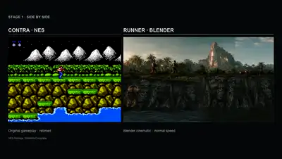</a><br>**Photorealistic Contra Game (Runner)** by [@illscience](https://x.com/illscience)<br><sub>Run-and-gun side scroller · 3D · multi-prompt</sub><br>Run and shoot through a photorealistic side-scrolling Contra-style level.<br>[**▶ Play**](https://runner-stage1.vercel.app/) · [Post · 1.2k ♥](https://x.com/illscience/status/2097059547328241971)

</td>
</tr>
<tr>
<td width="50%" valign="top">

<a href="http://astralwar.io">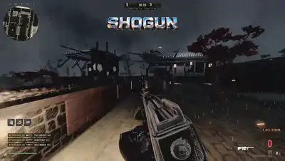</a><br>**Astral War** by [@0xRishi](https://x.com/0xRishi)<br><sub>Fps shooter · Three.js · long agentic session (1 day)</sub><br>Fight through living/undead modes in a CoD-World-at-War-inspired browser FPS, solo or online multiplayer.<br>[**▶ Play**](http://astralwar.io) · [Post · 979 ♥](https://x.com/0xRishi/status/2096079660605997264)

</td>
<td width="50%" valign="top">

<a href="https://app.usecrayon.ai/play/a9a3c165-74b3-4ff6-9588-ad97f829ddb5">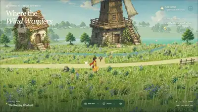</a><br>**Where the Wind Wanders** by [@TusharXo](https://x.com/TusharXo)<br><sub>Exploration adventure · Crayon/3D · multi-prompt</sub><br>Explore a flower-filled valley chasing wind-carried letters as the objective.<br>[**▶ Play**](https://app.usecrayon.ai/play/a9a3c165-74b3-4ff6-9588-ad97f829ddb5) · [Post · 824 ♥](https://x.com/TusharXo/status/2096037482739683574)

</td>
</tr>
<tr>
<td width="50%" valign="top">

<a href="https://satriodewantono.com/breakdance/"></a><br>**Oz Breakdance** by [@satrio_d](https://x.com/satrio_d)<br><sub>Timed dance/arcade · browser/ragdoll physics · multi-prompt</sub><br>Land ragdoll breakdance moves and hit foot targets in a timed scoring arena.<br>[**▶ Play**](https://satriodewantono.com/breakdance/) · [Post · 609 ♥](https://x.com/satrio_d/status/2096022866097758500)

</td>
<td width="50%" valign="top">

<a href="https://blackwater-roan.vercel.app/"></a><br>**BLACKWATER · Silent Harbor** by [@WoahWurdz](https://x.com/WoahWurdz)<br><sub>Tactical fps</sub><br>Infiltrate a rain-soaked freight terminal in a tactical FPS with a detailed carbine, combat HUD and nine hostiles.<br>[**▶ Play**](https://blackwater-roan.vercel.app/) · [Source](https://github.com/Hiraeth010/blackwater) · [Post · 342 ♥](https://x.com/WoahWurdz/status/2095958882732355908)

</td>
</tr>
<tr>
<td width="50%" valign="top">

<a href="https://wavedash.com/games/must-make-paperclips">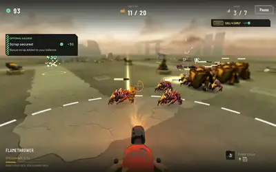</a><br>**MUST. MAKE. PAPERCLIPS.** by [@DannyLimanseta](https://x.com/DannyLimanseta)<br><sub>Tower defense/idle hybrid · Godot</sub><br>Godot-built paperclip-factory tower defense: deploy nail-gun turrets against waves while managing scrap resources.<br>[**▶ Play**](https://wavedash.com/games/must-make-paperclips) · [Post · 282 ♥](https://x.com/DannyLimanseta/status/2096977746891247758)

</td>
<td width="50%" valign="top">

<a href="https://alibi-blackthorn-manor.vercel.app/">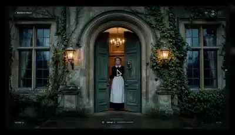</a><br>**ALIBI — The Last Light** by [@Christos_antono](https://x.com/Christos_antono)<br><sub>Detective mystery · browser/point-and-click · multi-prompt</sub><br>Investigate a manor and question suspects to find a murderer in a generative point-and-click mystery.<br>[**▶ Play**](https://alibi-blackthorn-manor.vercel.app/) · [Post · 243 ♥](https://x.com/Christos_antono/status/2096435122669297892)

</td>
</tr>
<tr>
<td width="50%" valign="top">

<a href="https://attack-on-titan-jet.vercel.app/">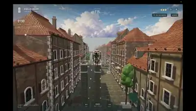</a><br>**Wings of Freedom — Levi Skyrun** by [@dhrubhagatsingh](https://x.com/dhrubhagatsingh)<br><sub>Traversal/parkour runner · Three.js · multi-prompt</sub><br>Grapple and fly as Captain Levi through a titan-traversal running course.<br>[**▶ Play**](https://attack-on-titan-jet.vercel.app/) · [Post · 231 ♥](https://x.com/dhrubhagatsingh/status/2098236388462223820)

</td>
<td width="50%" valign="top">

<a href="https://stormcolossus.netlify.app/">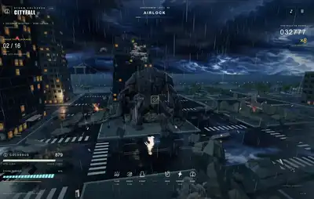</a><br>**Kaiju City Battle (Storm Colossus)** by [@majidmanzarpour](https://x.com/majidmanzarpour)<br><sub>Kaiju city battle/action · Three.js · multi-prompt</sub><br>Fight as a giant kaiju rampaging through a city in a live battle.<br>[**▶ Play**](https://stormcolossus.netlify.app/) · [Post · 204 ♥](https://x.com/majidmanzarpour/status/2096251574918013135)

</td>
</tr>
<tr>
<td width="50%" valign="top">

<a href="https://gogh-strike.surge.sh/"></a><br>**Gogh Strike** by [@petergostev](https://x.com/petergostev)<br><sub>5v5 fps · Three.js/Blender · long agentic session (6h)</sub><br>Play a painter-themed 5v5 first-person shooter set in Van Gogh's town, with bot teammates and rivals.<br>[**▶ Play**](https://gogh-strike.surge.sh/) · [Source](https://github.com/petergpt/gogh-strike) · [Post · 166 ♥](https://x.com/petergostev/status/2096013280519016608)

</td>
<td width="50%" valign="top">

<a href="https://weeping-angels.vercel.app/">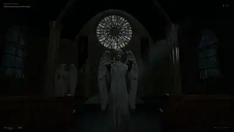</a><br>**Don't Look Away — Saint Orison** by [@BlendiByl](https://x.com/BlendiByl)<br><sub>Horror survival</sub><br>Church-set horror game: manage a flashlight and blink timer while angel statues approach; restore power to escape.<br>[**▶ Play**](https://weeping-angels.vercel.app/) · [Post · 148 ♥](https://x.com/BlendiByl/status/2100442177159729336)

</td>
</tr>
<tr>
<td width="50%" valign="top">

<a href="https://vale-dos-vinhedos.lucas579686.chatgpt.site/"></a><br>**The Free Game** by [@LucasMarquesSv](https://x.com/LucasMarquesSv)<br><sub>Medieval village builder</sub><br>Build a medieval village with roads, workers and production chains, presented as a detailed 3D tabletop settlement.<br>[**▶ Play**](https://vale-dos-vinhedos.lucas579686.chatgpt.site/) · [Source](https://github.com/LucasMarquesShiva/the-free-game) · [Post · 144 ♥](https://x.com/LucasMarquesSv/status/2096772160404504583)

</td>
<td width="50%" valign="top">

<a href="https://no-moat.petergyang.chatgpt.site/"></a><br>**No Moat** by [@petergyang](https://x.com/petergyang)<br><sub>Roguelike deckbuilder</sub><br>A startup-themed roguelike deckbuilder: recruit a team and play cards against copycats, bugs and cloud bills.<br>[**▶ Play**](https://no-moat.petergyang.chatgpt.site/) · [Post · 132 ♥](https://x.com/petergyang/status/2096297378584375672)

</td>
</tr>
<tr>
<td width="50%" valign="top">

<a href="https://cabsolutely.vercel.app/">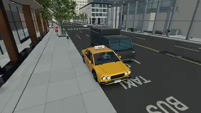</a><br>**Cabsolutely** by [@ailker](https://x.com/ailker)<br><sub>Taxi driving sim</sub><br>Open city-block taxi sim: pick up fares, track earnings and car condition against a shift timer and $60 in-game goal.<br>[**▶ Play**](https://cabsolutely.vercel.app/) · [Post · 125 ♥](https://x.com/ailker/status/2100705949468000655)

</td>
<td width="50%" valign="top">

<a href="https://agiofempires.com/"></a><br>**AGI of Empires — The Compute Wars** by [@timourxyz](https://x.com/timourxyz)<br><sub>Real-time strategy · browser 2D · multi-prompt</sub><br>Command an AI lab racing rivals to superintelligence in an Age-of-Empires-inspired RTS satire.<br>[**▶ Play**](https://agiofempires.com/) · [Post · 82 ♥](https://x.com/timourxyz/status/2096662786692776293)

</td>
</tr>
<tr>
<td width="50%" valign="top">

<a href="https://alesha-pro.github.io/bench-portal/games/voidbound-choir-of-ash/"></a><br>**Voidbound: The Choir of Ash** by [@superalesha](https://x.com/superalesha)<br><sub>Third-person hack-and-slash · Three.js/WebGL · multi-prompt</sub><br>Fight demons with sword combat, dodging and area magic in a cathedral arena above a dead star.<br>[**▶ Play**](https://alesha-pro.github.io/bench-portal/games/voidbound-choir-of-ash/) · [Source](https://github.com/alesha-pro/bench-portal) · [Post · 71 ♥](https://x.com/superalesha/status/2095988972879335792)

</td>
<td width="50%" valign="top">

<a href="https://suzune-aoi-fighters.szou2003.chatgpt.site/">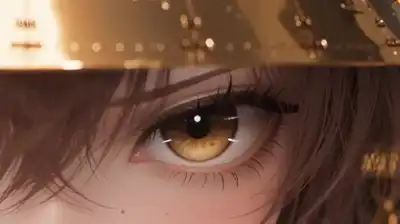</a><br>**CHRONO RAID — SUZUNE & AOI** by [@szounft](https://x.com/szounft)<br><sub>Fighting game · browser 2D · one-shot</sub><br>Fight as SUZUNE against a boss with special-move cut-ins and victory animations.<br>[**▶ Play**](https://suzune-aoi-fighters.szou2003.chatgpt.site/) · [Post · 70 ♥](https://x.com/szounft/status/2098310992770007365)

</td>
</tr>
<tr>
<td width="50%" valign="top">

<a href="https://wesche.com/lab/astra/boat-explorer/"></a><br>**Sundrift — Take the Slow Way Home** by [@WescheNex1q](https://x.com/WescheNex1q)<br><sub>Sailing exploration · Three.js</sub><br>Slow-paced sailing exploration game tracking nautical-mile distance and nearest-shore proximity.<br>[**▶ Play**](https://wesche.com/lab/astra/boat-explorer/) · [Post · 68 ♥](https://x.com/WescheNex1q/status/2100043868565561533)

</td>
<td width="50%" valign="top">

<a href="https://www.spawn.co/@izkimar/the-crownless/play"></a><br>**The Crownless** by [@Izkimar](https://x.com/Izkimar)<br><sub>Action roguelike · Spawn platform</sub><br>Roguelike action game on the Spawn platform: melee/jump combat through camps with leveling and soul upgrades.<br>[**▶ Play**](https://www.spawn.co/@izkimar/the-crownless/play) · [Post · 59 ♥](https://x.com/Izkimar/status/2100753871903855095)

</td>
</tr>
<tr>
<td width="50%" valign="top">

<a href="https://onemorevine.bennash.dev/"></a><br>**One More Vine — Into the Wild** by [@bennash](https://x.com/bennash)<br><sub>Jungle platformer · browser 2D · multi-prompt</sub><br>Swing on vines across four jungle platforming levels, dodging pits and crocodiles, Pitfall-style.<br>[**▶ Play**](https://onemorevine.bennash.dev/) · [Post · 54 ♥](https://x.com/bennash/status/2096282758930645170)

</td>
<td width="50%" valign="top">

<a href="https://gpt6astra-game.vercel.app/"></a><br>**Harbor Skirmish** by [@OpenDesignHQ](https://x.com/OpenDesignHQ)<br><sub>Harbor combat/arcade · Three.js</sub><br>Fight through a coastal town skirmish, part of a head-to-head model comparison build.<br>[**▶ Play**](https://gpt6astra-game.vercel.app/) · [Post · 52 ♥](https://x.com/OpenDesignHQ/status/2097635757917983223)

</td>
</tr>
<tr>
<td width="50%" valign="top">

<a href="https://fluffy-biscotti-dad318.netlify.app/"></a><br>**前线指令 / Frontline Command** by [@HDLhN783wtLkpPR](https://x.com/HDLhN783wtLkpPR)<br><sub>Modern-war rts</sub><br>Build a base, contest resource zones and command tanks, infantry, aircraft and drones against AI armies in a modern-war RTS, using spies and intelligence to gain an advantage.<br>[**▶ Play**](https://fluffy-biscotti-dad318.netlify.app/) · [Post · 30 ♥](https://x.com/HDLhN783wtLkpPR/status/2097321360641122393)

</td>
<td width="50%" valign="top">

<a href="https://bubucn.com/ai-model-evals/flop-club/game/index.html"></a><br>**FLOP CLUB** by [@BubuStd](https://x.com/BubuStd)<br><sub>Diving/trick sports · browser 3D · one-shot</sub><br>Dive off a high platform, pull flips, and try to land in the target ring.<br>[**▶ Play**](https://bubucn.com/ai-model-evals/flop-club/game/index.html) · [Post · 26 ♥](https://x.com/BubuStd/status/2096402783805354091)

</td>
</tr>
<tr>
<td width="50%" valign="top">

<a href="https://tidal-rush-paradise-gp.skirano.chatgpt.site/"></a><br>**TIDAL RUSH — Paradise GP** by [@alexgetmancom](https://x.com/alexgetmancom)<br><sub>Kart racer · browser 3D</sub><br>Race a kart through a tropical circuit with drifting.<br>[**▶ Play**](https://tidal-rush-paradise-gp.skirano.chatgpt.site/) · [Post · 25 ♥](https://x.com/alexgetmancom/status/2095598460921614825)

</td>
<td width="50%" valign="top">

<a href="https://luna-crimson-requiem.ponsuke.chatgpt.site/"></a><br>**LUNA — Crimson Requiem** by [@ponsuke_otowa](https://x.com/ponsuke_otowa)<br><sub>Side-scrolling action · browser 2D · one-shot</sub><br>Fight through a gothic red-moon street as LUNA in a SNES-style side-scrolling action game.<br>[**▶ Play**](https://luna-crimson-requiem.ponsuke.chatgpt.site/) · [Post · 25 ♥](https://x.com/ponsuke_otowa/status/2096531744933425299)

</td>
</tr>
<tr>
<td width="50%" valign="top">

<a href="https://orr-rush-bengaluru.ravitheja.chatgpt.site/"></a><br>**Bengaluru ORR Rush** by [@ravithejads](https://x.com/ravithejads)<br><sub>Street racing · browser</sub><br>Race through Bengaluru's Outer Ring Road from Bellandur to Marathahalli, dodging traffic and potholes.<br>[**▶ Play**](https://orr-rush-bengaluru.ravitheja.chatgpt.site/) · [Post · 23 ♥](https://x.com/ravithejads/status/2097181044625887392)

</td>
<td width="50%" valign="top">

<a href="https://mir176-dragon-warrior.geekcatxx.chatgpt.site/"></a><br>**热血归来 · 八荒幻世 / Mir176 Dragon Warrior** by [@GeekCatX](https://x.com/GeekCatX)<br><sub>Action rpg (legend of mir-inspired)</sub><br>A Legend-inspired action RPG with warrior, mage and taoist classes, equipment, dungeon combat and auto-battle.<br>[**▶ Play**](https://mir176-dragon-warrior.geekcatxx.chatgpt.site/) · [Post · 15 ♥](https://x.com/GeekCatX/status/2097530887558865115)

</td>
</tr>
<tr>
<td width="50%" valign="top">

<a href="https://neonwake.ethraship.com/"></a><br>**Neon Wake — Dubai Coast** by [@captain_m1k](https://x.com/captain_m1k)<br><sub>Boat racing · browser 3D · multi-prompt</sub><br>Race a boat along a neon-lit Dubai coastline circuit, four boats over three laps.<br>[**▶ Play**](https://neonwake.ethraship.com/) · [Post · 13 ♥](https://x.com/captain_m1k/status/2098310479714369926)

</td>
<td width="50%" valign="top">

<a href="https://dead-end.replit.app/">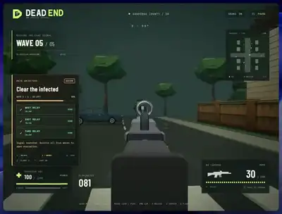</a><br>**DEAD END — Oakridge** by [@msdkim0424](https://x.com/msdkim0424)<br><sub>Survival horror/wave shooter</sub><br>3D zombie-survival shooter with 12 enemies per wave, shotgun/flare item switching, extraction goal.<br>[**▶ Play**](https://dead-end.replit.app/) · [Post · 12 ♥](https://x.com/msdkim0424/status/2099852357660262425)

</td>
</tr>
<tr>
<td width="50%" valign="top">

<a href="https://asteroids-deepfield-cockpit.dan200200.chatgpt.site/"></a><br>**ASTEROIDS · Deepfield** by [@DantesClown](https://x.com/DantesClown)<br><sub>Space shooter cockpit sim</sub><br>Pilot an Asteroids-style cockpit with four camera views, radar, twin cannons and inertial flight.<br>[**▶ Play**](https://asteroids-deepfield-cockpit.dan200200.chatgpt.site/) · [Post · 4 ♥](https://x.com/DantesClown/status/2096085439052452064)

</td>
<td width="50%" valign="top">

<a href="https://threapchills.github.io/MagicCarpetWizard/"></a><br>**Magic Carpet Wizard** by [@threapchills](https://x.com/threapchills)<br><sub>3d arcade flying/combat · WebGL2</sub><br>Fly a magic carpet and cast spells in a 3D browser arcade game.<br>[**▶ Play**](https://threapchills.github.io/MagicCarpetWizard/) · [Source](https://github.com/threapchills/MagicCarpetWizard)

</td>
</tr>
<tr>
<td width="50%" valign="top">

<a href="https://sanguo-jiangshan.vercel.app">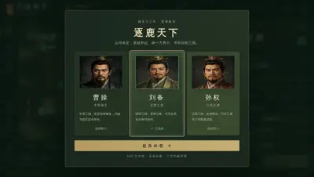</a><br>**Three Kingdoms: Hundred Heroes** by MartinDelophy<br><sub>Turn-based grand strategy · React/TypeScript · multi-prompt</sub><br>Run a turn-based campaign across 15 cities with resources, rival factions and 108 recruitable officers.<br>[**▶ Play**](https://sanguo-jiangshan.vercel.app) · [Source](https://github.com/MartinDelophy/awesome-gpt-6-astra/tree/main/works/three-kingdoms)

</td>
<td width="50%" valign="top">

<a href="https://bonkshot.com/"></a><br>**Bonkshot** by [@edmund5](https://x.com/edmund5)<br><sub>Physics destruction/puzzle · browser physics</sub><br>Aim, drag and launch characters to smash enemy structures and trigger chain-reaction explosions.<br><sub>🎮 drag to aim and release to launch</sub><br>[**▶ Play**](https://bonkshot.com/) · [Post](https://x.com/edmund5/status/2097603093819261002)

</td>
</tr>
<tr>
<td width="50%" valign="top">

<a href="https://bench-portal.pages.dev/games/boat-astra-deepseek/"></a><br>**Tidebreak: Corsair Run** by alesha-pro<br><sub>Boat combat racer · Three.js · multi-prompt</sub><br>Follow checkpoint gates through palm islands and a sea cave, collect weapon upgrades and fight enemy boats after a waterfall jump.<br>[**▶ Play**](https://bench-portal.pages.dev/games/boat-astra-deepseek/) · [Source](https://github.com/alesha-pro/bench-portal/tree/main/games/boat-astra-deepseek)

</td>
<td width="50%" valign="top">

<a href="https://bench-portal.pages.dev/games/breach-blacksite-astra/"></a><br>**BREACH — Blacksite** by alesha-pro<br><sub>Horde-survival fps · Three.js</sub><br>Fight escalating waves of enemies with three detailed weapons, recoil-and-inertia gunplay, sprint/slide/reload animations and procedural audio.<br><sub>🎮 WASD move, mouse aim/fire, likely sprint/slide/reload keys</sub><br>[**▶ Play**](https://bench-portal.pages.dev/games/breach-blacksite-astra/) · [Source](https://github.com/alesha-pro/bench-portal/tree/main/games/breach-blacksite-astra)

</td>
</tr>
<tr>
<td width="50%" valign="top">

<a href="https://bench-portal.pages.dev/games/gpt-6-astra-2026-09-11/"></a><br>**GPT-6 Astra 11.09.2026 (ZERO MERCY)** by alesha-pro<br><sub>Arena-survival fps · Three.js</sub><br>Survive escalating hordes with three weapons, red-dot/iron sights, grenades, explosive barrels and ammo drops in a shader-lit arena.<br><sub>🎮 WASD move, mouse aim/fire, sprint-slide movement</sub><br>[**▶ Play**](https://bench-portal.pages.dev/games/gpt-6-astra-2026-09-11/) · [Source](https://github.com/alesha-pro/bench-portal/tree/main/games/gpt-6-astra-2026-09-11)

</td>
<td width="50%" valign="top">

<a href="https://bench-portal.pages.dev/games/kart-astra-deepseek/"></a><br>**Lumen Rally** by alesha-pro<br><sub>Kart racer · Three.js · multi-prompt</sub><br>A browser kart racer built from a shared game brief, one of a four-way model comparison set.<br>[**▶ Play**](https://bench-portal.pages.dev/games/kart-astra-deepseek/) · [Source](https://github.com/alesha-pro/bench-portal/tree/main/games/kart-astra-deepseek)

</td>
</tr>
<tr>
<td width="50%" valign="top">

<a href="https://bench-portal.pages.dev/games/kart-astra-solo/"></a><br>**Tidebloom Rally** by alesha-pro<br><sub>Kart racer · Three.js · one-shot</sub><br>A browser kart racer built by GPT-6 Astra solo (no subagents), from the same brief as three other comparison entries.<br>[**▶ Play**](https://bench-portal.pages.dev/games/kart-astra-solo/) · [Source](https://github.com/alesha-pro/bench-portal/tree/main/games/kart-astra-solo)

</td>
<td width="50%" valign="top">

<a href="https://bench-portal.pages.dev/games/voidrunner-astra/"></a><br>**VOIDRUNNER: Orbital Combat League** by alesha-pro<br><sub>Anti-gravity combat racer · Three.js</sub><br>Race three Blender-authored hovercraft above a fractured ocean world, boosting, airbrake-drifting and fighting rivals with weapons and shields.<br>[**▶ Play**](https://bench-portal.pages.dev/games/voidrunner-astra/) · [Source](https://github.com/alesha-pro/bench-portal/tree/main/games/voidrunner-astra)

</td>
</tr>
<tr>
<td width="50%" valign="top">

<a href="https://noita.myai1010.top/astra/"></a><br>**EMBER DEEP** by JerryLiu369<br><sub>Destructible pixel-physics roguelike (noita-style) · Canvas 2D (vanilla JS) · long agentic session (24h)</sub><br>Descend through a destructible, pixel-simulated cave system mixing alchemy and falling-sand physics, casting chained wand spells while managing heat/material interactions.<br>[**▶ Play**](https://noita.myai1010.top/astra/) · [Source](https://github.com/JerryLiu369/noita-benchmark/pull/3)

</td>
<td width="50%" valign="top">

<a href="https://astrafloor.berochlu.workers.dev/"></a><br>**Astra Floor** by BEROCHLU<br><sub>Fps zombie survival</sub><br>Survive escalating zombie waves in a 3D first-person shooter with recoil control, stamina management, katana attacks and a final boss.<br>[**▶ Play**](https://astrafloor.berochlu.workers.dev/)

</td>
</tr>
<tr>
<td width="50%" valign="top">

<a href="https://stadium-elite.mindblown.ai/"></a><br>**Stadium Elite — El Clásico** by [@mind](https://x.com/mind)<br><sub>3d football/soccer</sub><br>Play an 11-a-side Barcelona–Real Madrid football match, passing, shooting and switching players in a 3D stadium.<br>[**▶ Play**](https://stadium-elite.mindblown.ai/)

</td>
<td width="50%" valign="top">

<a href="https://iron-bastion.zecoba.workers.dev/"></a><br>**IRON BASTION / 钢铁防线** by chat01.ai<br><sub>3d tower defense</sub><br>Defend a beacon against waves of enemy tanks across six sectors in a 3D battlefield with destructible brick walls, a dash and an electromagnetic pulse.<br>[**▶ Play**](https://iron-bastion.zecoba.workers.dev/)

</td>
</tr>
<tr>
<td width="50%" valign="top">

<a href="https://dust-ii-map.yelin8130.chatgpt.site/"></a><br>**DUST II · 沙漠行动 / Desert Operations** by lin_ye / lin ye<br><sub>Fps (cs-style)</sub><br>Counter-Strike Dust II-style FPS with bots, weapon switching (AK-47/USP-S) and kill tracking.<br>[**▶ Play**](https://dust-ii-map.yelin8130.chatgpt.site/)

</td>
<td width="50%" valign="top">

<a href="https://dave-2cm.pages.dev/"></a><br>**潜水员戴夫 / Dave the Diver** by dudu<br><sub>Underwater sim + restaurant management</sub><br>A browser recreation of Dave the Diver combining underwater spearfishing, sushi-restaurant management and island farming.<br>[**▶ Play**](https://dave-2cm.pages.dev/)

</td>
</tr>
<tr>
<td width="50%" valign="top">

<a href="https://dust-front.mustafaakin.dev/"></a><br>**DUST FRONT** by [@mustafaakin](https://x.com/mustafaakin)<br><sub>Single-player rts</sub><br>Command a single-player RTS army, build a base, capture sites and coordinate ground and air forces.<br>[**▶ Play**](https://dust-front.mustafaakin.dev/)

</td>
<td width="50%" valign="top">

<a href="https://landifyoucan.naylalabs.xyz/"></a><br>**Land, If You Can** by Taniai_<br><sub>Flight sim</sub><br>Cabin-fever intro then a full jet cockpit with tower comms, autopilot and manual flight controls (200 knots, 3,000 ft observed).<br><sub>🎮 E to stand, R to call tower, P to take manual control</sub><br>[**▶ Play**](https://landifyoucan.naylalabs.xyz/)

</td>
</tr>
<tr>
<td width="50%" valign="top">

<a href="https://mindblown.ai/games/the-sunshard"></a><br>**The Sunshard** by [@mindblown_ai](https://x.com/mindblown_ai)<br><sub>Voxel action rpg</sub><br>Explore a voxel-style action RPG, fight Hollowborn with Spark Bolt and Sunburst, blink away from danger and awaken the sun gate.<br>[**▶ Play**](https://mindblown.ai/games/the-sunshard)

</td>
<td width="50%" valign="top">

<a href="https://glider.game/"></a><br>**Glider — One Throw. Endless Sky.** by mrtwizzles<br><sub>Paper-airplane flight sim · long agentic session</sub><br>Endless paper-airplane flight game with free-roam exploration, distance/speed/altitude HUD; author reports a 34-hour x-high build.<br>[**▶ Play**](https://glider.game/)

</td>
</tr>
<tr>
<td width="50%" valign="top">

<a href="https://junk-run.pages.dev/"></a><br>**JUNK RUN** by [@hermesailab](https://x.com/hermesailab)<br><sub>Vehicle-building downhill racer</sub><br>Assemble a gravity-powered vehicle from scrapyard parts and send it downhill; starts in a first-person workshop.<br>[**▶ Play**](https://junk-run.pages.dev/) · [Post](https://x.com/hermesailab/status/2097508053901840850)

</td>
<td width="50%" valign="top">

<a href="https://dragonwild.seranotte.chatgpt.site/">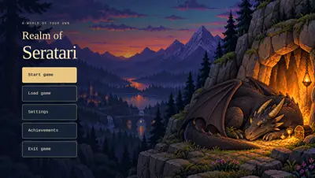</a><br>**Realm of Seratari** by Nightstar31415<br><sub>Dragon-riding exploration</sub><br>Fly a fire dragon between locations on a mid-sized fantasy map, with HP/stamina/hunger stats.<br>[**▶ Play**](https://dragonwild.seranotte.chatgpt.site/)

</td>
</tr>
<tr>
<td width="50%" valign="top">

<a href="https://apex-club-racing.vercel.app"></a><br>**APEX CLUB — Bay Kart Grand Prix** by Ryan<br><sub>Kart racing · Three.js</sub><br>Race three laps around Bay Circuit, choose from six karts, and charge corner-exit mini turbos to climb the solo rankings or score for a 4v4 team.<br>[**▶ Play**](https://apex-club-racing.vercel.app)

</td>
<td width="50%" valign="top">

<a href="https://knightmare-medusa-3d.robin-hwang.chatgpt.site/"></a><br>**Knightmare — Medusa’s Temple** by [@MinHoHwang1](https://x.com/MinHoHwang1)<br><sub>Boss-fight action</sub><br>3D boss-battle arena against Medusa with a purify special move and cooldown-based combat.<br>[**▶ Play**](https://knightmare-medusa-3d.robin-hwang.chatgpt.site/)

</td>
</tr>
<tr>
<td width="50%" valign="top">

<a href="https://drone-io.vercel.app/"></a><br>**DRONE.IO — Proving Grounds** by [@OMASMohamad](https://x.com/OMASMohamad)<br><sub>Drone combat</sub><br>Drone combat arena against six AI opponents with radar scans and energy-managed abilities.<br>[**▶ Play**](https://drone-io.vercel.app/)

</td>
<td width="50%" valign="top">

<a href="https://agentgames.dev/play/dropzone-royale"></a><br>**Dropzone Royale** by Drakoniux<br><sub>Battle royale · AgentGames</sub><br>Battle-royale shooter with a build/loot phase, ammo pickups and a shrinking player count.<br>[**▶ Play**](https://agentgames.dev/play/dropzone-royale)

</td>
</tr>
</table>

## Download or build (2)

Playable, but needs a download, a build step, or a native engine.

### Claude Opus 5.5 (2)

<table>
<tr>
<td width="50%" valign="top">

<a href="https://github.com/bridge-mind/claude-opus-5.5-zombies-game"></a><br>**Dead Signal: Exclusion Zone** by [@bridgemindai](https://x.com/bridgemindai)<br><sub>Zombie extraction FPS · Three.js, TypeScript · One prompt in Claude Code</sub><br>Defend an uplink relay from zombie hordes, hunt an armored boss, then reach the helicopter before the contamination front.<br><sub>🎮 WASD, mouse, R reload, G grenade, Shift sprint</sub><br><sub><code>pnpm install && pnpm build && pnpm preview</code></sub><br>[Download](https://github.com/bridge-mind/claude-opus-5.5-zombies-game) · [Source](https://github.com/bridge-mind/claude-opus-5.5-zombies-game)

</td>
<td width="50%" valign="top">

<a href="https://github.com/OminousIndustries/OpusSkate"></a><br>**Concrete Jungle** by OminousIndustries<br><sub>Street skateboarding · C++17, SDL2, OpenGL · One-shot, single 4,925-line file</sub><br>Skate an early-2000s New York block with ollies, flip tricks, grabs, grinds and manuals, every mesh and sound generated in code.<br><sub>🎮 W push, A and D steer, Space ollie, J flip, K grab, L grind</sub><br><sub><code>g++ -O2 skate.cpp -lSDL2 -lGL -o skate && ./skate</code></sub><br>[Download](https://github.com/OminousIndustries/OpusSkate) · [Source](https://github.com/OminousIndustries/OpusSkate)

</td>
</tr>
</table>

## Watch only (15)

No public build yet. The creator's footage is the evidence.

### Claude Opus 5.5 (5)

<table>
<tr>
<td width="50%" valign="top">

<a href="https://x.com/noahwachnik/status/2102470200415166699"></a><br>**Lumen Vale** by [@noahwachnik](https://x.com/noahwachnik)<br><sub>Voxel sandbox · WebGL · About 1.5 hours of prompting</sub><br>A browser Minecraft with generated terrain from beaches to mountains, rippling water and dynamic day and night lighting.<br>[Post · 5.1k ♥](https://x.com/noahwachnik/status/2102470200415166699)

</td>
<td width="50%" valign="top">

<a href="https://x.com/edwinarbus/status/2102463453176979794"></a><br>**Antikythera** by [@edwinarbus](https://x.com/edwinarbus)<br><sub>Exploration puzzle · Single HTML file, WebGL and Web Audio · One-shot</sub><br>A game about the first computer, where every visual and every sound is generated live from code.<br>[Post · 3.2k ♥](https://x.com/edwinarbus/status/2102463453176979794)

</td>
</tr>
<tr>
<td width="50%" valign="top">

<a href="https://x.com/WoahWurdz/status/2102487879809126834">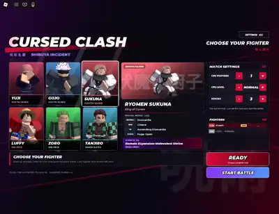</a><br>**Anime Smash Bros** by [@WoahWurdz](https://x.com/WoahWurdz)<br><sub>Platform fighter · Roblox Studio · One-shot</sub><br>Anime fighters brawl across Smash-style stages, built inside Roblox Studio using only the toolbox.<br>[Post · 3.1k ♥](https://x.com/WoahWurdz/status/2102487879809126834)

</td>
<td width="50%" valign="top">

<a href="https://x.com/The_Alex/status/2102440678282412195"></a><br>**The Ashen Gate** by [@The_Alex](https://x.com/The_Alex)<br><sub>Souls-like action RPG · WebGL · Early access build</sub><br>A third-person Souls-like with real melee combat and level design in an ash-covered gothic ruin.<br>[Post · 2.3k ♥](https://x.com/The_Alex/status/2102440678282412195)

</td>
</tr>
<tr>
<td width="50%" valign="top">

<a href="https://x.com/MatthewBerman/status/2102483668468195539"></a><br>**San Francisco in Unreal** by [@MatthewBerman](https://x.com/MatthewBerman)<br><sub>Open-world city sim · Unreal Engine</sub><br>A drivable San Francisco with people, pets and traffic, every agent in the city simulated.<br>[Post · 2.0k ♥](https://x.com/MatthewBerman/status/2102483668468195539)

</td>
<td width="50%" valign="top">


</td>
</tr>
</table>

### GPT-6 Astra (10)

<table>
<tr>
<td width="50%" valign="top">

<a href="https://x.com/theo/status/2095599934766764338"></a><br>**Browser 3D Game Prototype (Theo)** by [@theo](https://x.com/theo)<br><sub>Blender/Three.js · one-shot</sub><br>A 3D game prototype built and demonstrated running in the browser.<br>[Post · 13k ♥](https://x.com/theo/status/2095599934766764338)

</td>
<td width="50%" valign="top">

<a href="https://x.com/AiBattle_/status/2095994051354919049"></a><br>**Sonic in Godot: Max vs Medium** by [@AiBattle_](https://x.com/AiBattle_)<br><sub>Platformer · Godot · one-shot</sub><br>Two simple Sonic-style 3D running/platforming demos comparing Astra reasoning effort settings.<br>[Post · 10k ♥](https://x.com/AiBattle_/status/2095994051354919049)

</td>
</tr>
<tr>
<td width="50%" valign="top">

<a href="https://x.com/flavioAd/status/2095597137849446688"></a><br>**Minecraft-Style World** by [@flavioAd](https://x.com/flavioAd)<br><sub>Voxel sandbox · Three.js/WebGL · one-shot</sub><br>Walk through a block-based Minecraft-style voxel world generated from a single prompt.<br>[Post · 6.7k ♥](https://x.com/flavioAd/status/2095597137849446688)

</td>
<td width="50%" valign="top">

<a href="https://x.com/MengTo/status/2097291240672993773"></a><br>**Catan-Style Three.js Board Game** by [@MengTo](https://x.com/MengTo)<br><sub>Board game · Three.js · multi-prompt</sub><br>Play a Catan-style board game with animated pieces, guidance cards, AI opponents and trading.<br>[Post · 6.0k ♥](https://x.com/MengTo/status/2097291240672993773)

</td>
</tr>
<tr>
<td width="50%" valign="top">

<a href="https://x.com/seftsaint/status/2101395711015497764">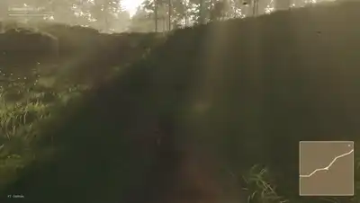</a><br>**Junnaid Valley Unreal World** by [@seftsaint](https://x.com/seftsaint)<br><sub>Exploration landscape · Unreal Engine · multi-prompt</sub><br>Walk a landscape world with trees and lighting, ported from Godot into Unreal Engine.<br>[Post · 5.8k ♥](https://x.com/seftsaint/status/2101395711015497764)

</td>
<td width="50%" valign="top">

<a href="https://x.com/konstiwohlwend/status/2097164513527357608">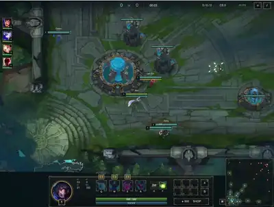</a><br>**League of Legends Browser Clone** by [@konstiwohlwend](https://x.com/konstiwohlwend)<br><sub>Moba · browser/WebGL · multi-prompt</sub><br>A browser recreation of League of Legends with recognizable champions and mechanics after two prompts.<br>[Post · 3.1k ♥](https://x.com/konstiwohlwend/status/2097164513527357608)

</td>
</tr>
<tr>
<td width="50%" valign="top">

<a href="https://x.com/anshuc/status/2096584624432374151">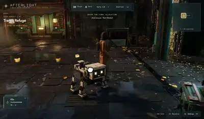</a><br>**Afterlight Robot World** by [@anshuc](https://x.com/anshuc)<br><sub>Atmospheric exploration · Three.js · long agentic session (8h)</sub><br>Explore a dystopian robot city scene with rain, warm lighting, detailed streets and procedural birds.<br>[Post · 1.9k ♥](https://x.com/anshuc/status/2096584624432374151)

</td>
<td width="50%" valign="top">

<a href="https://x.com/op7418/status/2096494840431386950"></a><br>**A Godot Roguelike Level** by [@op7418](https://x.com/op7418)<br><sub>Roguelike/action rpg · Godot</sub><br>Explore a 3D roguelike combat level with a day-night cycle, weather system, weapon switching, skills, and melee/ranged enemies.<br>[Post · 881 ♥](https://x.com/op7418/status/2096494840431386950)

</td>
</tr>
<tr>
<td width="50%" valign="top">

<a href="https://x.com/VikiingAI/status/2095598026916049024"></a><br>**Halo-Inspired Tesana FPS** by [@Thomas_jorgen](https://x.com/Thomas_jorgen)<br><sub>Fps · Tesana game maker · one-shot</sub><br>A Halo-inspired 10v10 multiplayer FPS prototype built in one prompt via the Tesana game maker.<br>[Post · 576 ♥](https://x.com/VikiingAI/status/2095598026916049024)

</td>
<td width="50%" valign="top">

<a href="https://x.com/DeryaTR_/status/2095945186643710171"></a><br>**Mario Kart–Style Racer (Three.js Alpha)** by [@DeryaTR_](https://x.com/DeryaTR_)<br><sub>Kart racer · Three.js</sub><br>Alpha-version browser kart racer with six toy cars, four festival-themed tracks, coin collection and a garage to buy upgrades.<br>[Post · 338 ♥](https://x.com/DeryaTR_/status/2095945186643710171)

</td>
</tr>
</table>

## Films and animations (14)

Music videos, short films and animations where the model wrote the code or drove the tool behind every frame.

### Claude Opus 5.5 (7)

<table>
<tr>
<td width="50%" valign="top">

<a href="https://x.com/alexalbert__/status/2102458348511879448"></a><br>**Claymation with a Single Prompt** by [@alexalbert__](https://x.com/alexalbert__)<br><sub>Animation · Blender · one-shot</sub><br>A stop-motion-style claymation scene modeled, textured and animated in Blender by Opus 5.5 from a single prompt directly inside claude.ai.<br>[Post · 2.5k ♥](https://x.com/alexalbert__/status/2102458348511879448)

</td>
<td width="50%" valign="top">

<a href="https://x.com/slimer48484/status/2097752569212756134"></a><br>**I'm Upping My P(Doom)** by [@slimer48484](https://x.com/slimer48484)<br><sub>Music video · 2:37 · p5.js / Canvas · long agentic session (two full generations in Claude Code)</sub><br>A painted-theater stage show that goes off the rails: a doodled AI named Clawd grows from a monitor sketch into a planet-sized superintelligence, dragging its creator through every AI-doom meme in the lyrics, opening and closing on the same painted curtain.<br>[Source](https://github.com/JohnHeibel/PDoomVideo) · [Post · 2.0k ♥](https://x.com/slimer48484/status/2097752569212756134)

</td>
</tr>
<tr>
<td width="50%" valign="top">

<a href="https://x.com/AndrewOnXYZ/status/2102512879258009818"></a><br>**Opus 5.5 Ultra Film** by [@AndrewOnXYZ](https://x.com/AndrewOnXYZ)<br><sub>Short film · 4:00 · Code, four agents · Four agents, about 1.5 hours</sub><br>A four-minute film made entirely from scratch by four Opus 5.5 agents, voice included, with no AI voice API.<br>[Post · 1.9k ♥](https://x.com/AndrewOnXYZ/status/2102512879258009818)

</td>
<td width="50%" valign="top">

<a href="https://x.com/alexalbert__/status/2102466523164274839"></a><br>**San Francisco's Market Street, 1906** by [@alexalbert__](https://x.com/alexalbert__)<br><sub>Animation · Blender · one-shot</sub><br>A historically accurate reconstruction of San Francisco's Market Street in 1906, just before the great earthquake, built and animated as a full 3D world in Blender from a single prompt.<br>[Post · 1.1k ♥](https://x.com/alexalbert__/status/2102466523164274839)

</td>
</tr>
<tr>
<td width="50%" valign="top">

<a href="https://x.com/Voxyz_ai/status/2102531681450119426"></a><br>**Small Print** by [@Voxyz_ai](https://x.com/Voxyz_ai)<br><sub>Short film · 0:29 · Canvas/JS · one-shot</sub><br>Claude receives a pile of daily requests, circles the human moment hidden inside each one ("one hand. baby's asleep"), and drops the words into a jar; at night the words turn into stars that join into a constellation. No image assets, all frames drawn in JS with model-synthesized Python music, polished second-by-second in post.<br>[Post · 779 ♥](https://x.com/Voxyz_ai/status/2102531681450119426)

</td>
<td width="50%" valign="top">

<a href="https://x.com/blueemi99/status/2102511304456212763"></a><br>**Opus 5.5 Voxel Self-Portrait** by [@blueemi99](https://x.com/blueemi99)<br><sub>Animation · 0:15 · 3D / voxel modeling · one-shot</sub><br>A short animated self-portrait of Claude rendered entirely in voxels, with its own idle animations and detailing, generated from a single prompt.<br>[Post · 492 ♥](https://x.com/blueemi99/status/2102511304456212763)

</td>
</tr>
<tr>
<td width="50%" valign="top">

<a href="https://chetaslua.github.io/little-neighbourhood/"></a><br>**Little Neighbourhood** by [@chetaslua](https://x.com/chetaslua)<br><sub>Launch-style animation · Three.js · multi-prompt</sub><br>A self-made launch video for Claude showing it helping people around a little animated neighbourhood, rendered live in the browser as a looping cinematic scene.<br>[**▶ Watch live**](https://chetaslua.github.io/little-neighbourhood/) · [Post · 381 ♥](https://x.com/chetaslua/status/2102370144546889735)

</td>
<td width="50%" valign="top">


</td>
</tr>
</table>

### GPT-6 Astra (7)

<table>
<tr>
<td width="50%" valign="top">

<a href="https://x.com/petergostev/status/2096264296099459079"></a><br>**Craig Federighi, Recreated in Blender** by [@petergostev](https://x.com/petergostev)<br><sub>Short film · Blender · one-shot</sub><br>A Blender recreation of a well-known Craig Federighi WWDC clip, rebuilt shot-for-shot as an animated 3D scene from a single prompt.<br>[Post · 12k ♥](https://x.com/petergostev/status/2096264296099459079)

</td>
<td width="50%" valign="top">

<a href="https://x.com/duncantrussell/status/2096003511104508411"></a><br>**The Backrooms, in Blender** by [@duncantrussell](https://x.com/duncantrussell)<br><sub>Short film · Blender · multi-prompt</sub><br>A liminal-space 'Backrooms' scene modeled and lit in Blender, with VHS-style post effects and sound design, all built and rendered by Astra directly in Blender from about five prompts over 30 minutes (plus 20 minutes to export).<br>[Post · 9.5k ♥](https://x.com/duncantrussell/status/2096003511104508411)

</td>
</tr>
<tr>
<td width="50%" valign="top">

<a href="https://x.com/reach_vb/status/2096612996256579653"></a><br>**Rickroll, Rebuilt in Blender** by [@reach_vb](https://x.com/reach_vb)<br><sub>Music video · 0:58 · Blender · multi-prompt</sub><br>A side-by-side comparison of the original Rick Astley 'Never Gonna Give You Up' video against a stylized 3D Rick Astley built and animated entirely by Astra in Blender, driving subagents to verify the geometry and web search to source reference assets.<br>[Post · 8.7k ♥](https://x.com/reach_vb/status/2096612996256579653)

</td>
<td width="50%" valign="top">

<a href="https://x.com/tomkrcha/status/2095756085890310311"></a><br>**Steam Train, Drawing to Blender** by [@tomkrcha](https://x.com/tomkrcha)<br><sub>Animation · Blender · one-shot</sub><br>A hand-drawn steam-train sketch turned into a 3,295-object, fully editable, animated Blender train model built directly by Astra.<br>[Post · 6.9k ♥](https://x.com/tomkrcha/status/2095756085890310311)

</td>
</tr>
<tr>
<td width="50%" valign="top">

<a href="https://x.com/DeryaTR_/status/2095659170661904804"></a><br>**T Cells: A 5-Minute Educational Film** by [@DeryaTR_](https://x.com/DeryaTR_)<br><sub>Motion graphics · 5:42 · Remotion · one-shot</sub><br>A code-animated explainer about T cells, scripted and assembled by Astra in Remotion with Imagegen visuals from a single prompt; Astra also picked HeyGen for narration.<br>[Post · 2.1k ♥](https://x.com/DeryaTR_/status/2095659170661904804)

</td>
<td width="50%" valign="top">

<a href="https://x.com/athrix_codes/status/2096209514248958161"></a><br>**Launching GPT-6 Astra (by GPT-6 Astra)** by [@athrix_codes](https://x.com/athrix_codes)<br><sub>Motion graphics · HyperFrames · multi-prompt</sub><br>A reference-led, HyperFrames-built launch film for GPT-6 Astra itself, generated from a six-line prompt plus a reference video; ElevenLabs supplied the voice and sound effects on top of Astra's motion-graphics build.<br>[Post · 832 ♥](https://x.com/athrix_codes/status/2096209514248958161)

</td>
</tr>
<tr>
<td width="50%" valign="top">

<a href="https://x.com/Dimillian/status/2096478021234426059"></a><br>**Manhattan Cinematic Flyover** by [@Dimillian](https://x.com/Dimillian)<br><sub>Motion graphics · 3D modeling / camera animation · multi-prompt</sub><br>A modeled Manhattan skyline built from topography and map data, with a sweeping cinematic flyover trailer -- warm lighting, dramatic camera angles -- produced end to end by Astra.<br>[Post · 196 ♥](https://x.com/Dimillian/status/2096478021234426059)

</td>
<td width="50%" valign="top">


</td>
</tr>
</table>

## Add a game

Open a pull request that adds one entry (films take `kind: film`) to [`data/games.yaml`](data/games.yaml) with the post that names the model. Then:

```sh
npm install
npm run media -- <id>       # fetches the creator's video from X and builds the preview
npm run screenshot -- <id>  # only for entries without a video: screenshots the live page
npm run build             # regenerates README.md and index.html
```

Media belongs to the original creators and is linked back to their posts. If you made a game listed here and want it changed or removed, open an issue.
